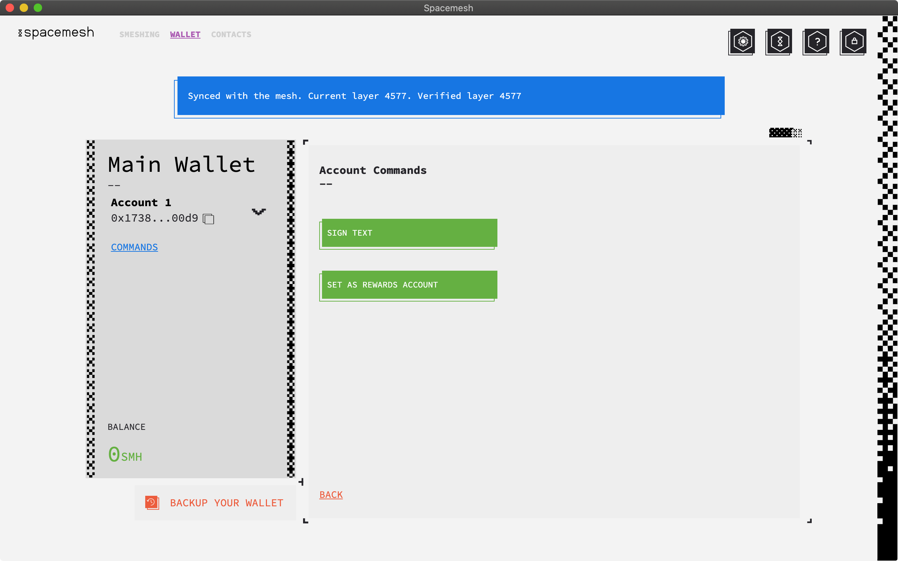
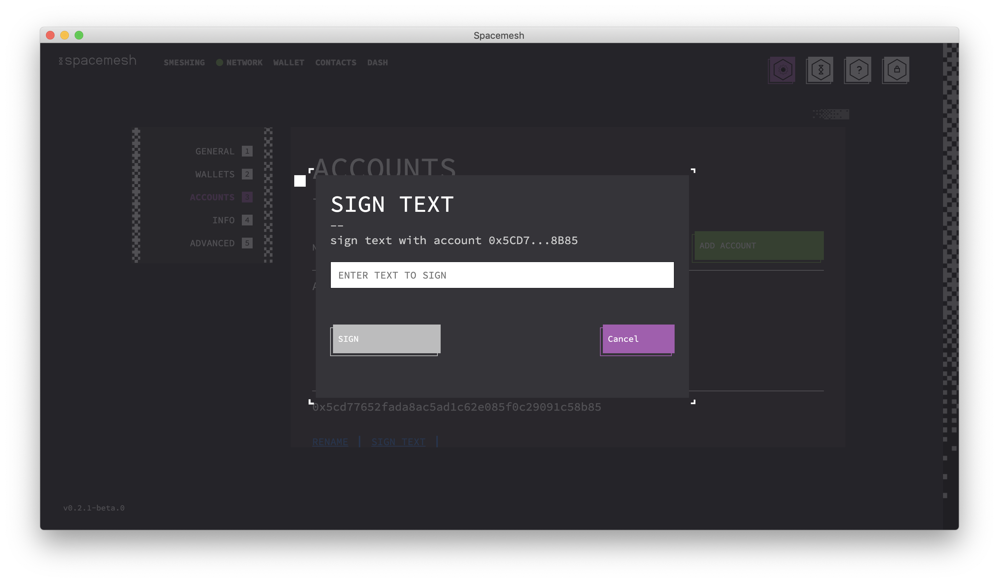
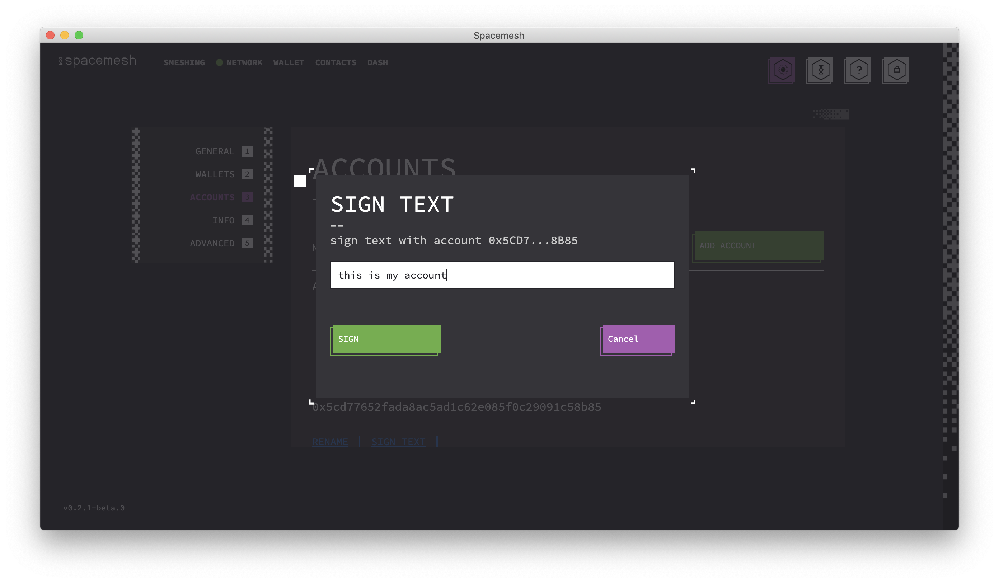
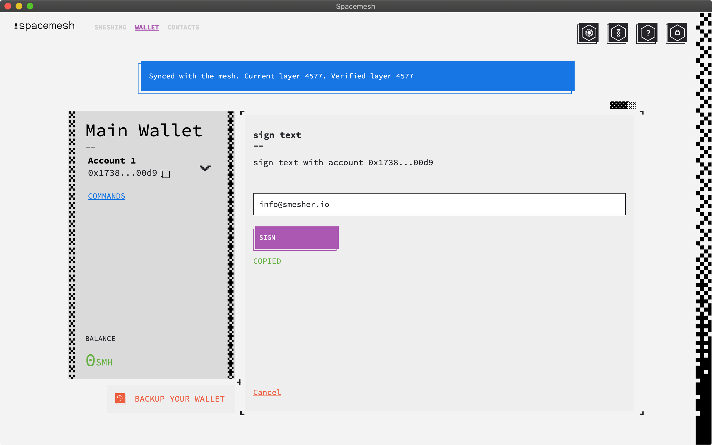

## Working with Your Accounts

Go to the `SETTINGS` screen and click on `ACCOUNT SETTINGS` in the navigation box on the left.  

Notice the blue buttons underneath each of your accounts. All of them will have `RENAME` and `SIGN TEXT`. If you have more than one account, the ones that are not currently your rewards account will have an additional `SET AS REWARDS ACCOUNT` command.

## Signing Text

`SIGN TEXT` allows you to sign a text message such as your full name or email address.
Signing is done with your account's secret key and requires access to it.
Signing your name with your account proves that the name is the name of the owner of the account.
As owner is defined as someone who has access to the account's secret key.

In order to use the `SIGN TEXT` feature, go to `SETTINGS`. Once there, notice the box on the left of the screen and click on `ACCOUNT SETTINGS`.

1. Under each account, you'll notice three commands: `RENAME`, `SIGN TEXT`, and `REWARDS ACCOUNT`. Click on the `SIGN TEXT` command.

2. Enter the text you want to sign such as your full name into the text box.

3. Click the 'SIGN' button.

The signature text is copied to the clipboard and can be sent to anyone.

4. Create an email or type a text message to the person you want to share the signature with and paste the signature copied to the clipboard in step 3.
