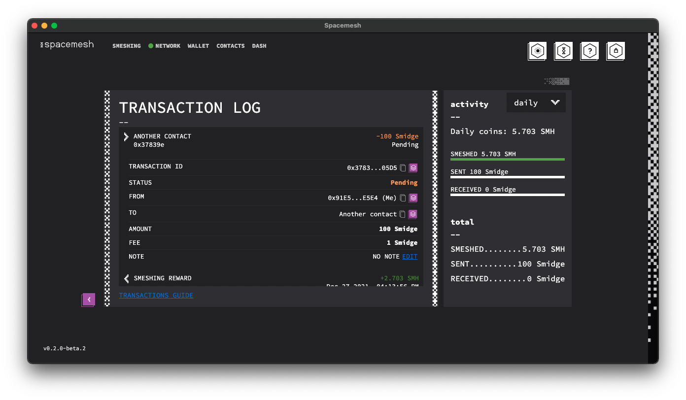

# Working with Contacts

This feature allows you to save the wallet address of other users as permanent contacts for faster and more convenient transactions. Contacts are saved encrypted to the wallet file for maximum privacy.

## Adding a Contact

1. Navigate to the Contact screen by clicking `CONTACTS` in the top-left side of the screen.

2. Click on the `CREATE NEW CONTACT` button.

You should see this box appear:

3. Enter the nickname and wallet address in the corresponding fields.

 Click `CREATE`.

4. Enter your wallet's password:

Click `UNLOCK` to confirm

5. You should now see this confirmation, as well as your contact listed:

Congratulations! You have just created your contact!

## Creating a Contact From a Transaction

Go to the `Transactions` area of your Wallet Screen:

1. Click on `ALL TRANSACTIONS` to view the full transactions log.

2. Click on a transaction to view its details:

3. Click the small button next to the wallet address on the `FROM` line.

A purple box will appear on the right, with the wallet address automatically filled in. Choose your desired nickname.

4. Click `CREATE`.

Enter your password:

5. Click `UNLOCK` to confirm.

Go to your `CONTACTS` screen. Notice that your new contact has been added.

## Sending Smesh to a Contact

Just click on the contact of your choice, and you'll be taken to the transaction screen!
