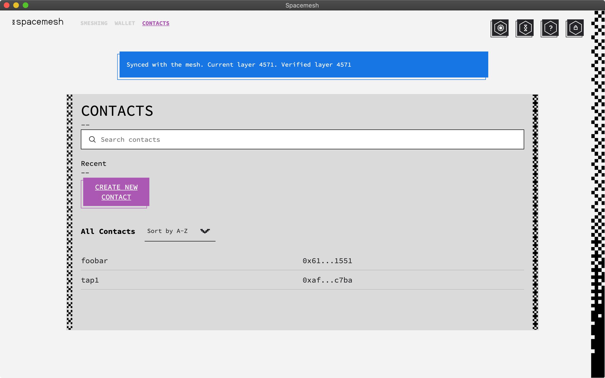
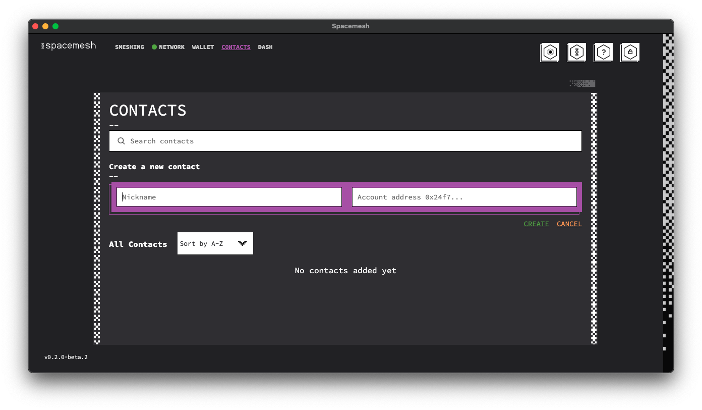
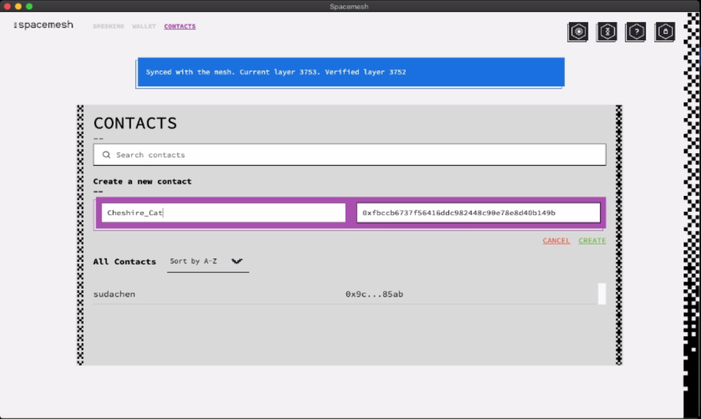
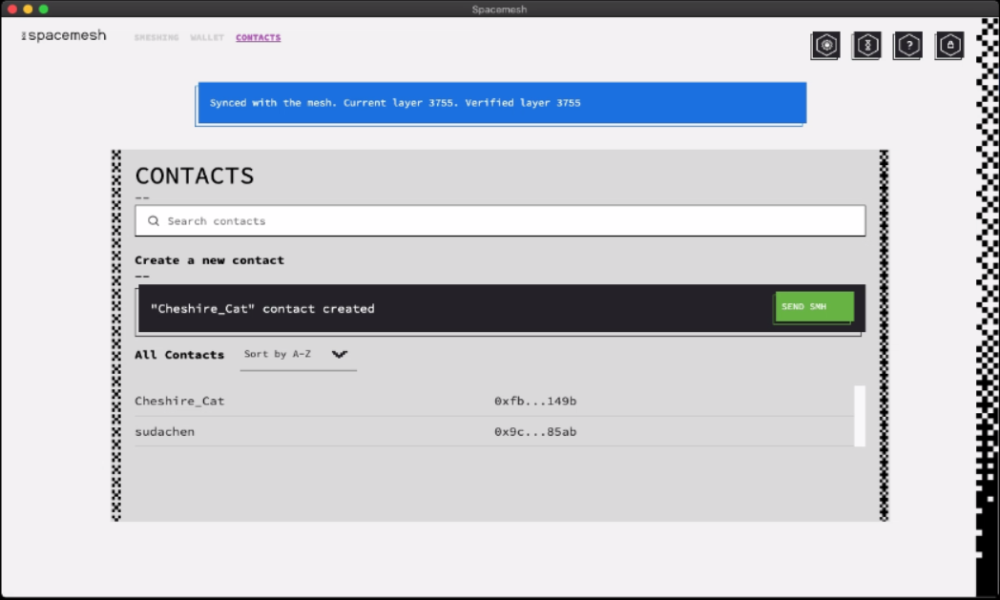
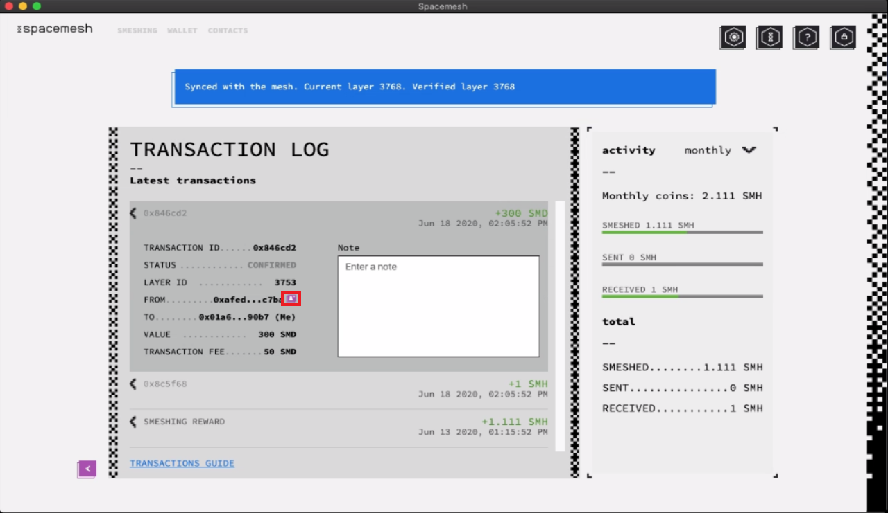
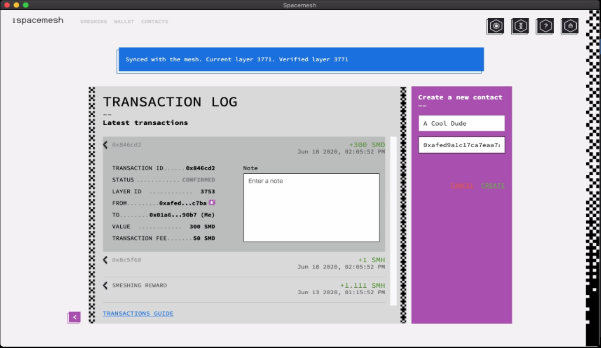
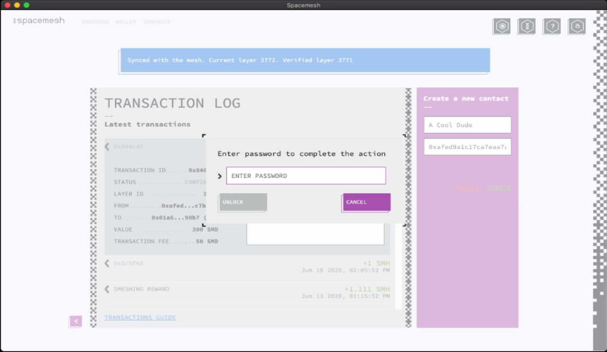
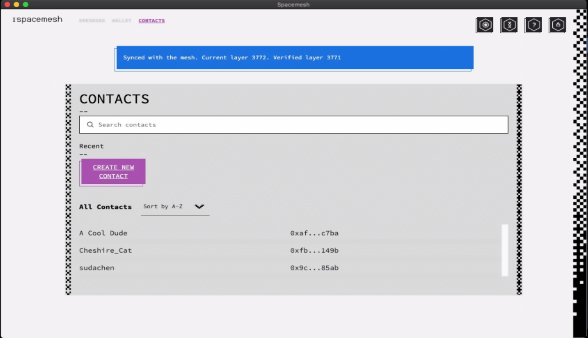

# Adding a Contact

1. Navigate to the Contact screen by clicking `CONTACTS` in the top-left side of the screen.

2. Click on the `CREATE NEW CONTACT` button.

You should see this box appear:

3. Enter the nickname and wallet address in the corresponding fields.

4. Click `CREATE`.

Enter your password:

5. Click `UNLOCK` to confirm

You should now see this confirmation, as well as your contact listed:

Congratulations! You have just created your contact!

## Creating a Contact From a Transaction

Go to the `Transactions` area of your Wallet Screen:

1. Click on `ALL TRANSACTIONS` to view the full transactions log.

2. Click on a transaction to view its details:

3. Click the small button next to the wallet address on the `FROM` line.

A purple box will appear on the right, with the wallet address automatically filled in. Choose your desired nickname.

4. Click `CREATE`.

Enter your password:

5. Click `UNLOCK` to confirm.

Go to your `CONTACTS` screen. Notice that your new contact has been added.

