# Advanced Wallet Features

# Backing up

There are 3 options to get to Wallet Backup Screen:

_OPTION 1:_

At Main Screen - until first time backup there will be the red banner under “BALANCE” section saying “BACKUP YOUR WALLET”

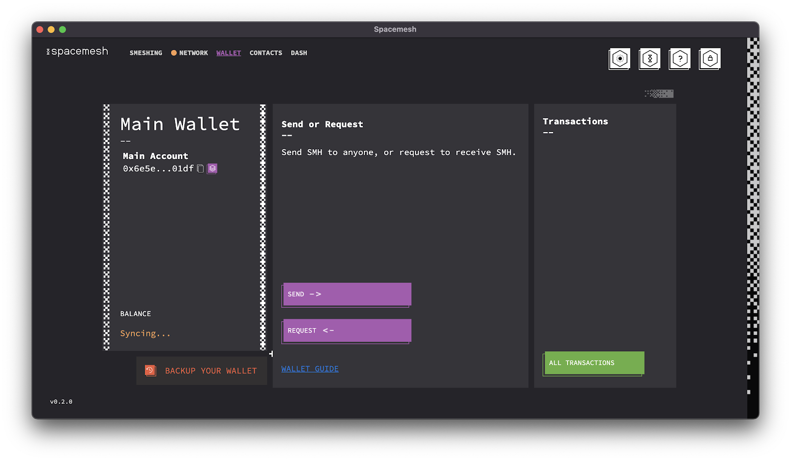

_OPTION 2:_

On the top right corner of the main screen there is button <SETTINGS> at top right corner

Click on the left menu on “WALLETS” option, then scroll down until you see “Wallet Backup” section

Now you are at Wallet Backup Options Screen

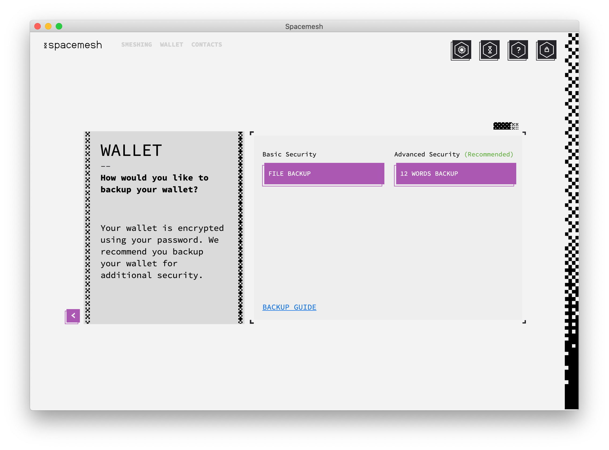

### Option ‘FILE BACKUP’

Click on <FILE BACKUP> button and you’ll get to this screen

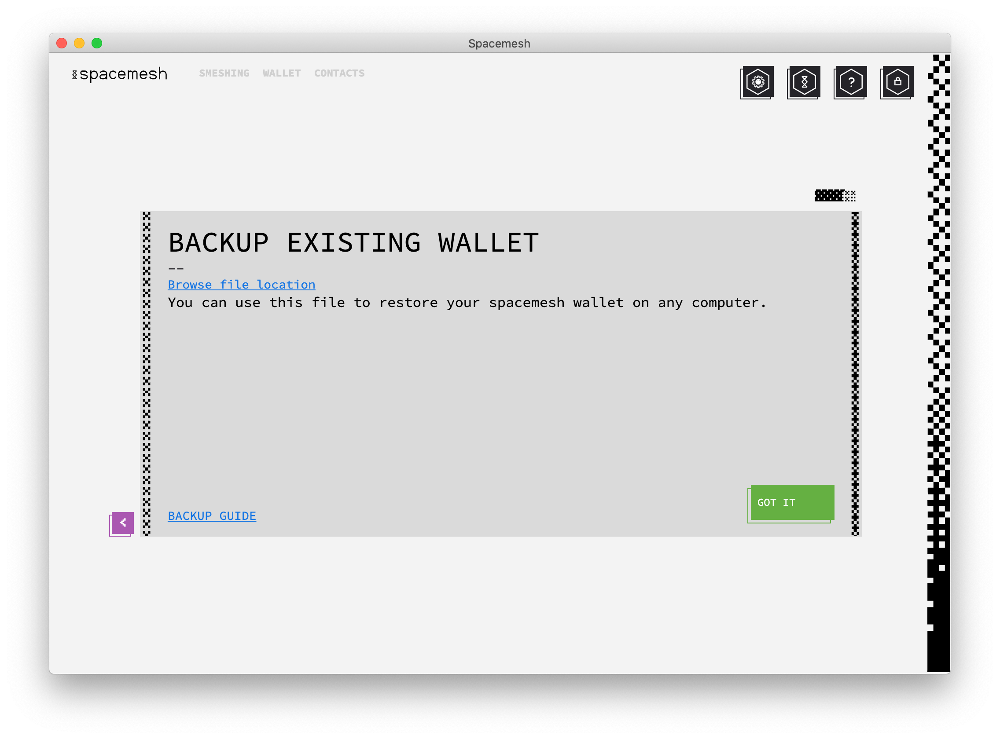

Clicking on <show file location> button will open file browser window with the wallet backup file selected. The file is saved in “Documents” folder and can be moved to any other folder or ledger.

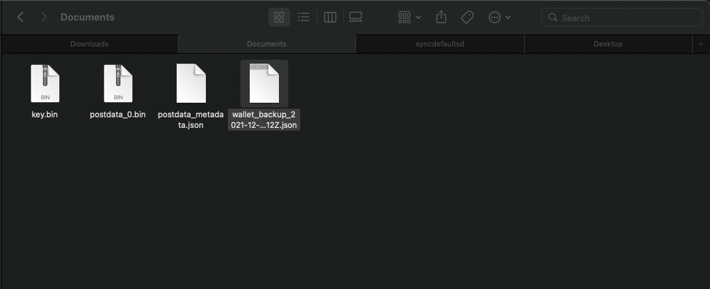

### Option ’12 WORDS BACKUP’

Click on <12 WORDS BACKUP> button and you’ll get to this screen

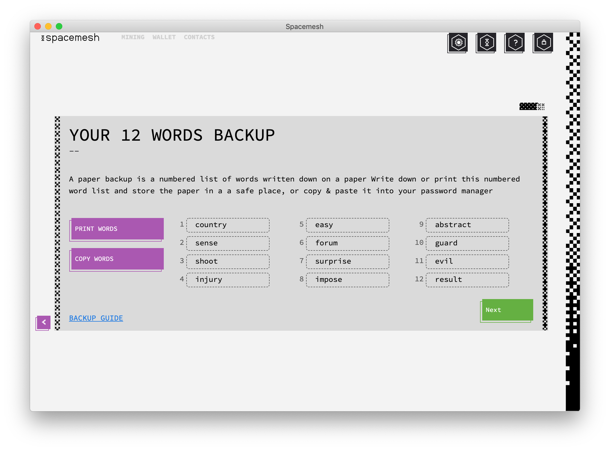

These words can be used to restore your wallet anywhere using Spacemesh software. They are also called as _seed_ or _seed words_.

For _cold storage_ option - keeping 12 words offline on the paper in some safe place, press <PRINT WORDS> button. This will open standard print dialog and you can print the words on your printer.

The other button is <COPY WORDS> - if you want to save the words in some kind of encrypted file or vault. After clicking <COPY WORDS> button you will see message in green color confirming that words are copied to your clipboard.

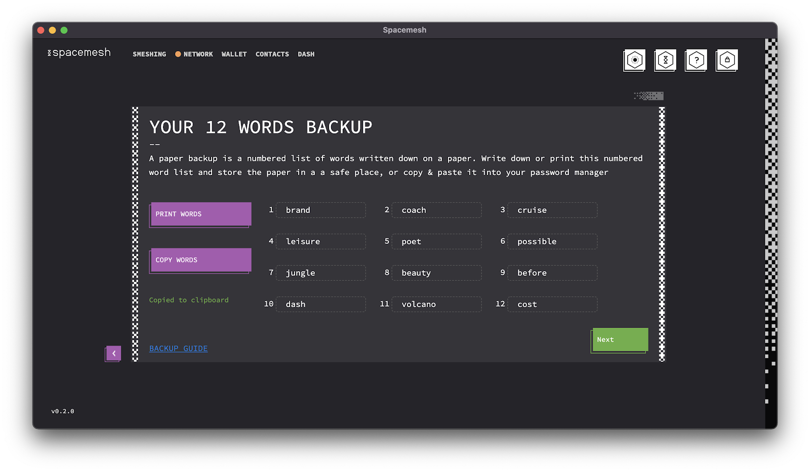

After clicking <NEXT> button you’ll get to this screen:

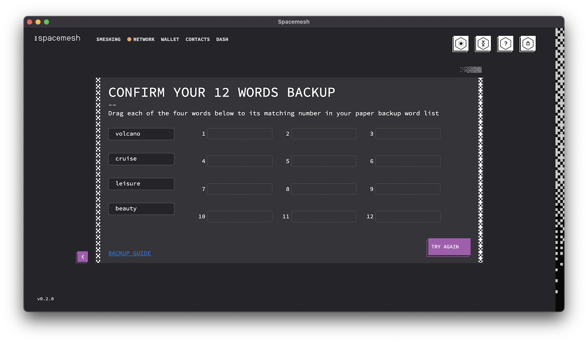

You can practice restoring the words in the right order by dragging and dropping the randomly selected 4 words in right places. If you’ve placed all the words and it is not the correct order than you’ll get this message under the <TRY AGAIN> button

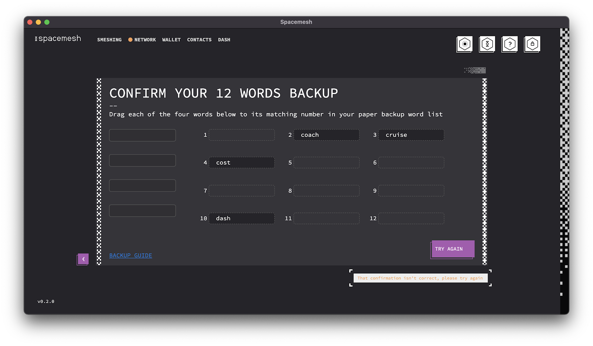

If you’ve placed the words in the right order than you’ll see this message

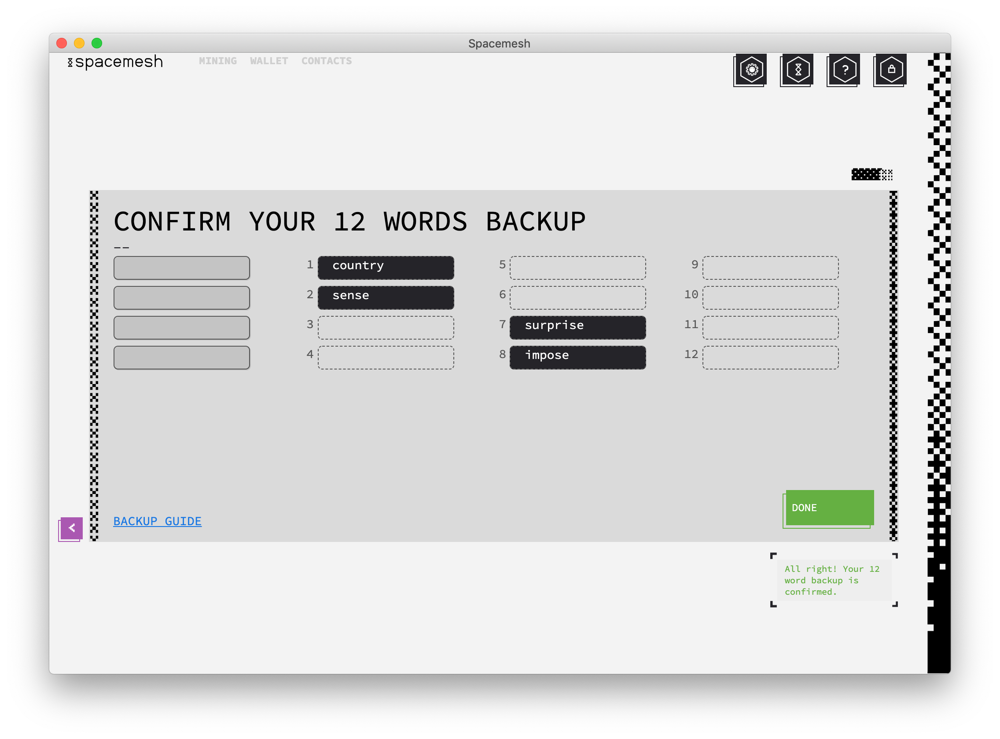

**IMPORTANT**: _you don’t have to place the words in correct order - your wallet is already backed-up, this is just to test you if you want to._

Now you can return to main screen by click <DONE> or arrow back (<) button.

# Rename wallet

Go to Settings Screen

Click on <WALLETS> on in left menu and you’ll see <Display Name> section

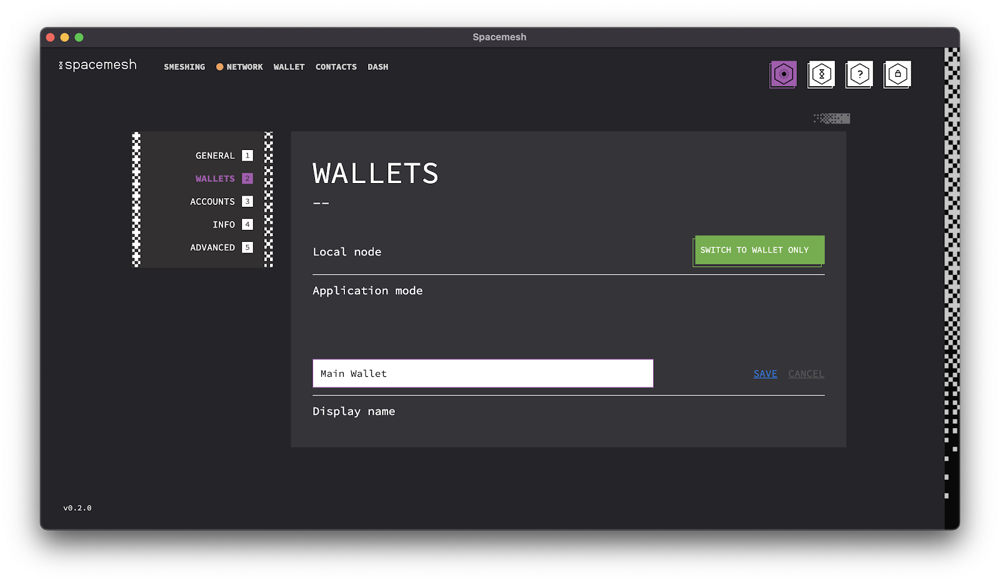

After clicking on <RENAME> button, the wallet name will switch to input where you can type in the new name for the wallet

After typing in new name click on <SAVE> button if you want to finish renaming, or <CANCEL> if you wish to leave the existing name

If you clicked <SAVE> button you will see the renamed name like this

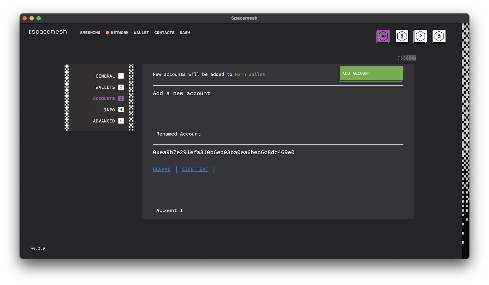

# Change wallet password

Go to Setting Screen

Click on <WALLETS> option in left menu and scroll down until you see <Wallet Password> section

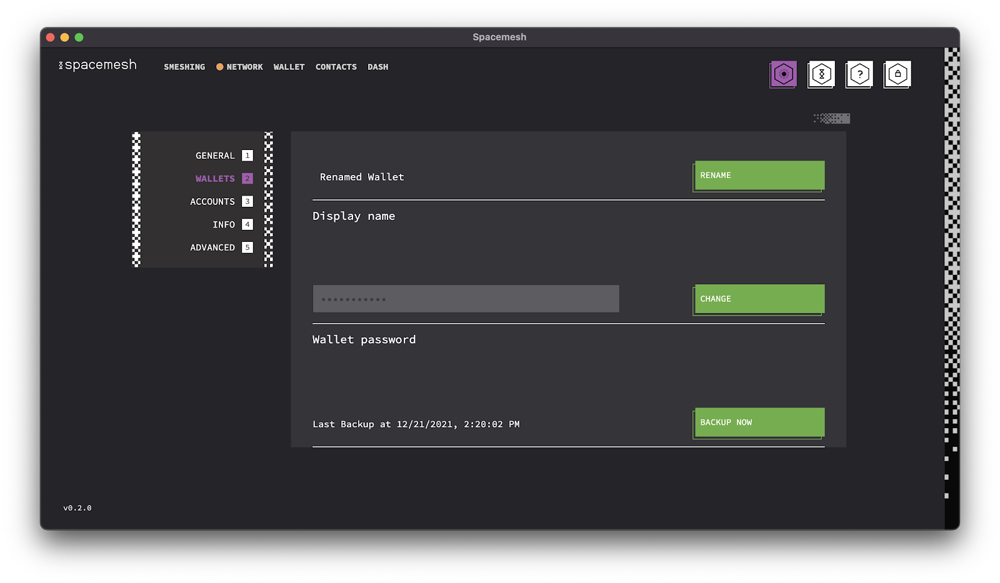

Click on <CHANGE> button and password line will switch to 2 inputs for typing in new password and confirming it again

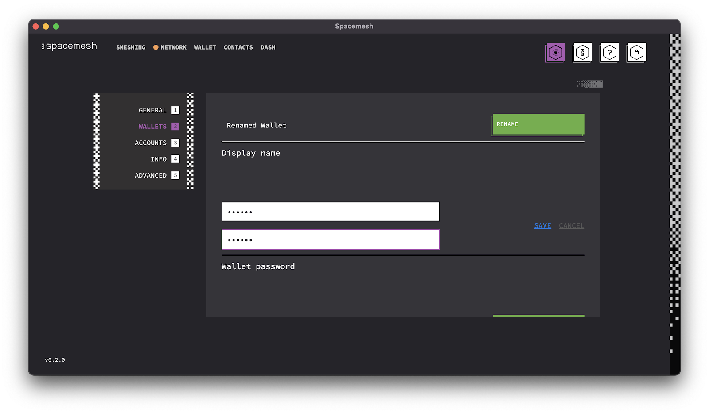

If you wish to proceed with changing password - click <SAVE>, if not - click <CANCEL>

The screen will look as before clicking <CHANGE>

If you clicked <SAVE> than wallet password will be updated!

# Restoring a wallet from file or from 12 words

There are 3 options to restore wallet:

_OPTION 1:_

After clean install of Spacemesh wallet on the intro screen you’ll see a button

<RESTORE EXISTING WALLET> left to <SETUP> button!

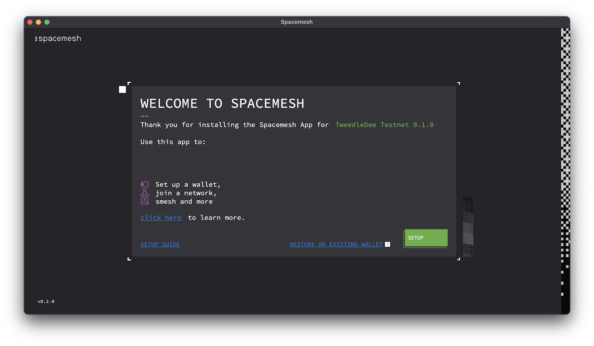

_OPTION 2:_

If there are existing wallets - on app start at the Unlock Wallet Screen there is a button <RESTORE> below password input field

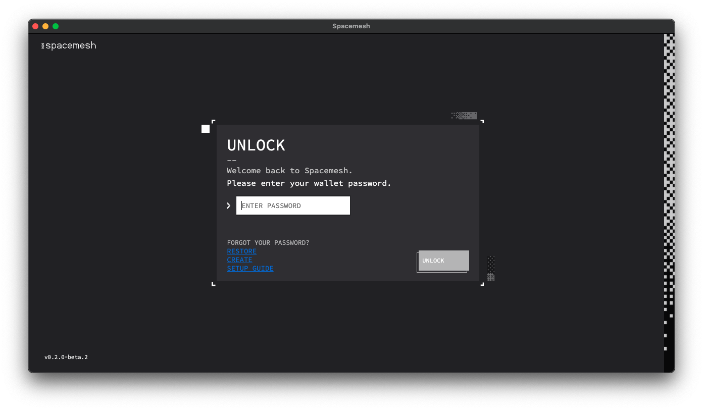

_OPTION 3:_

If you have an unlocked wallet, go to Settings Screen

Click on <WALLETS> option in left menu and scroll down until you see <Restore Wallet> section and click on <RESTORE> button

After following one of the options you’ll reach this screen

Now there are _2_ options to restore the wallet.

_Option A: File Restore_

After clicking on <RESTORE FROM FILE> you’ll get to this screen

You can drag and drop your file on the designated area or click on <locate file on your computer>

After selecting file the screen will look like this:

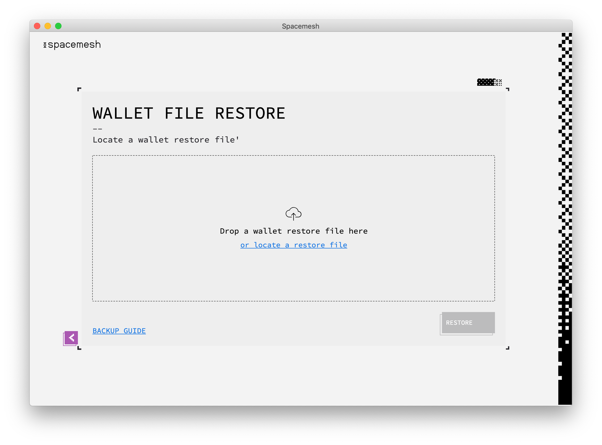

Click on <RESTORE> button at the bottom right and you’ll get to Protect Wallet Screen where you need to type in and retype the password you want for the wallet

After clicking <NEXT> button you will see loader

And then you’ll continue the regular setup wallet flow!

_Option B: 12 Words Restore_

After clicking on <12 WORDS RESTORE> button you’’ll get to this screen

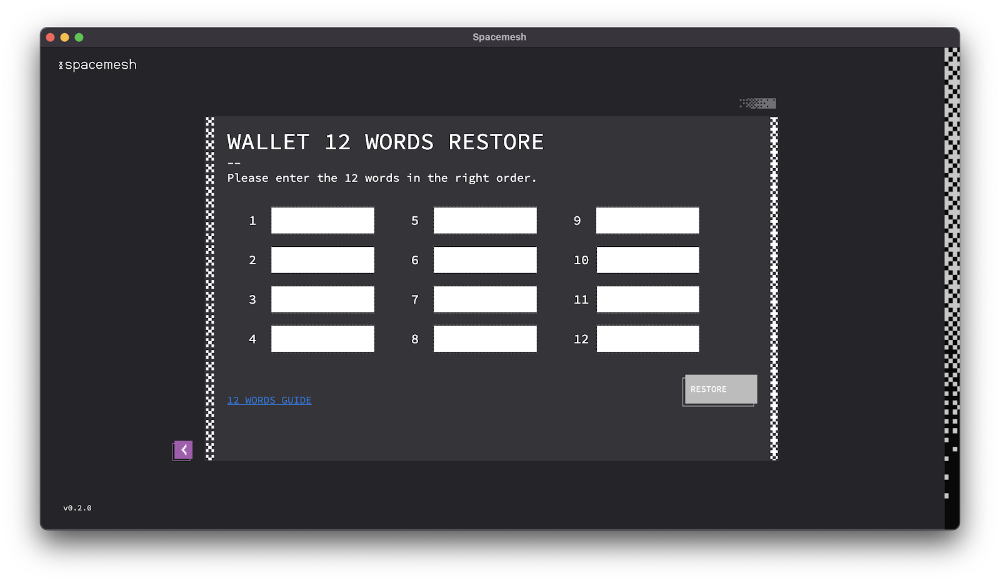

If you’ve typed correct words in correct order than you’ll get to Protect Wallet screen and can proceed as first time wallet setup!

# Adding an account to wallet

Go to Settings Screen

Click on <ACCOUNTS> option in left menu

You’ll see <ADD ACCOUNT> button. Click it and you’ll see popup asking to enter wallet’s password

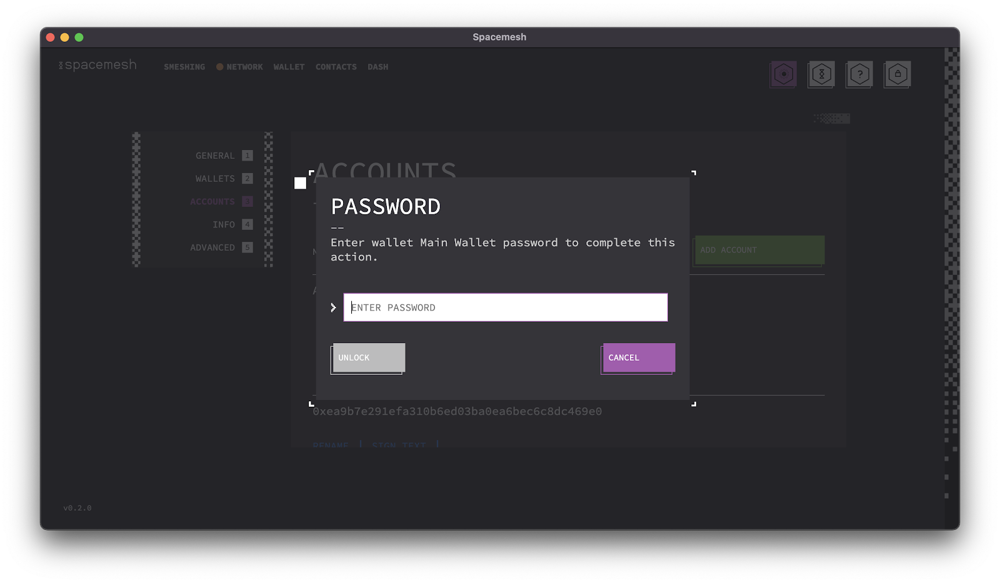)

After entering correct password the popup will disappear and you will see new account below existing accounts. Default name for created account is “Account <number>”

# Renaming an account

Go to Settings Screen

Click on <ACCOUNTS> option in left menu

Scroll to until you see account which you want to rename. Below account name you will see <RENAME> button.

After clicking on <RENAME> button the name of the account will switch to an input where you can type new account name

After typing the new name, if you want to save it click <SAVE> or to discard changes - click <CANCEL>

If you clicked on <SAVE> you will see a popup asking you to enter wallet password!

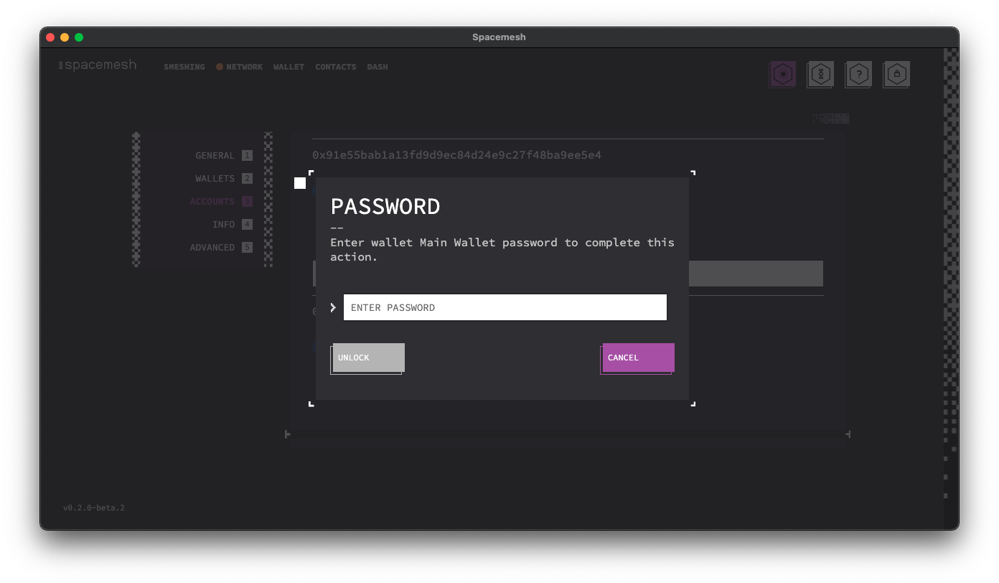

After entering correct password and clicking <UNLOCK> button in the popup, it will disappear and you will see the renamed account!

# Creating contacts

There are _2_ options to create contact.

_Option 1:_

In order to create new contact go to <CONTACTS> tab!

Click on <CREATE NEW CONTACT> button!

The screen will change to this state where you have 2 inputs - one for nickname and second for address!

After filling the details and pressing <CREATE> button you will see the popup asking to enter wallet password

After entering correct password and clicking <UNLOCK> button you will see newly created contact in contacts list

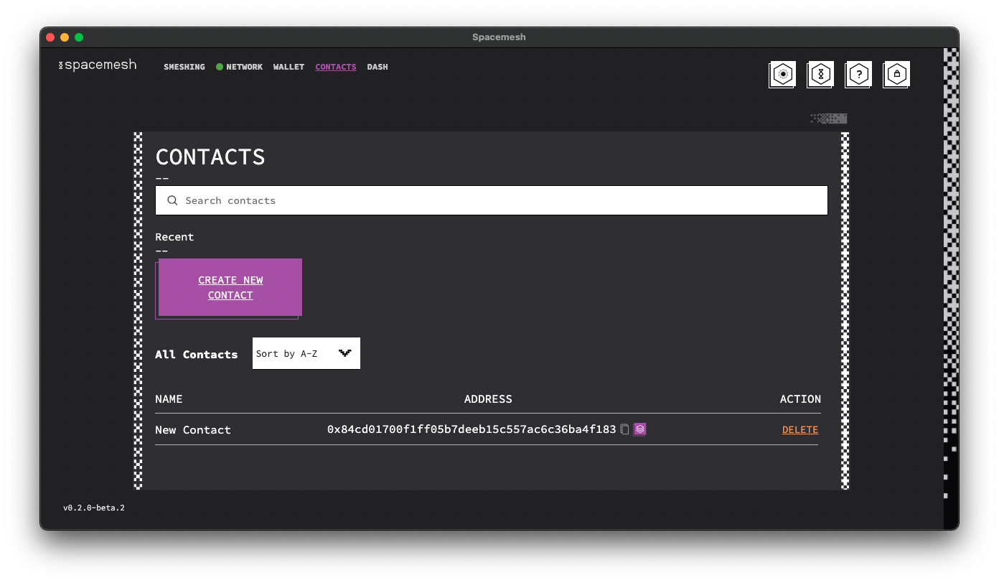

_Option 2:_

In wallet main screen click on <ALL TRANSACTIONS> button

Click on transaction you want to add to contacts

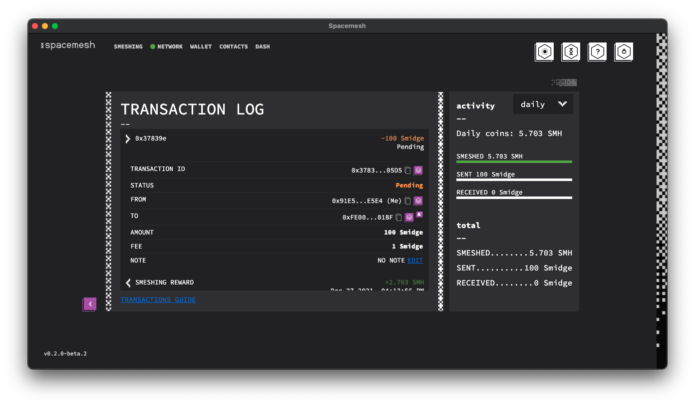

Click on small person icon to activate <Create New Contact> section. The screen will look like this:

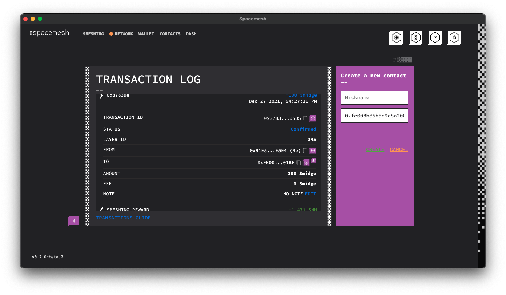

Fill the details and click on <CREATE> button. Then you’ll see the password popup

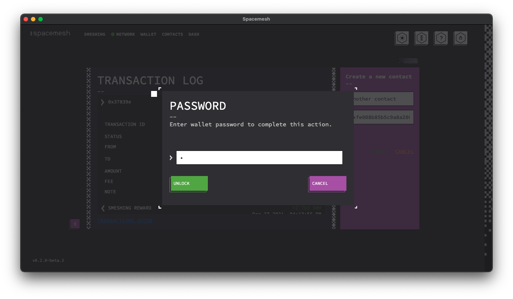

After entering the correct password and clicking <UNLOCK> button, the popup will disappear and you will see the transaction with the nickname you’ve create the contact with

# Using existing contacts

Go to <CONTACTS> tab.

Move your mouse over the contact’s nickname you want to send coins to

Click on it and you’ll navigate to Send Coins Screen with the field <TO> already filled with the contact’s address you’ve clicked

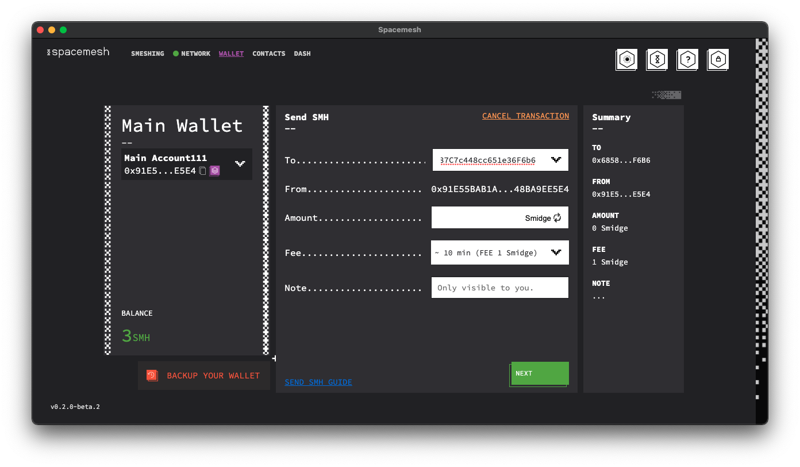

Now proceed with sending coins as usual
