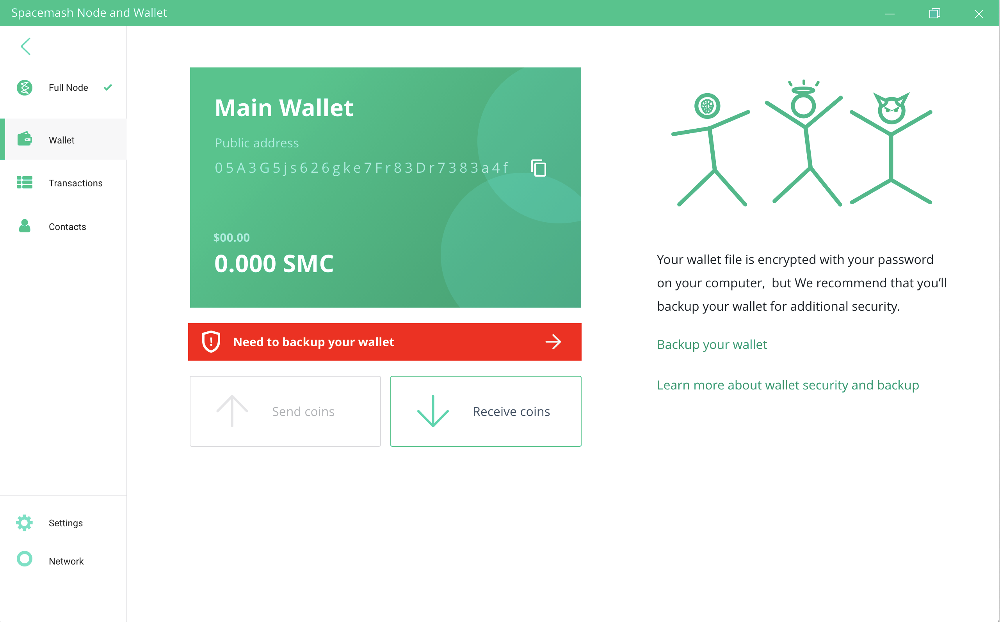
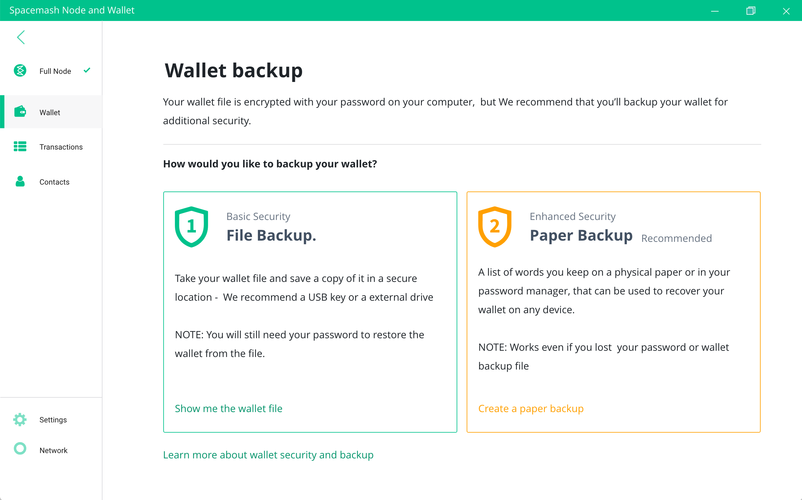
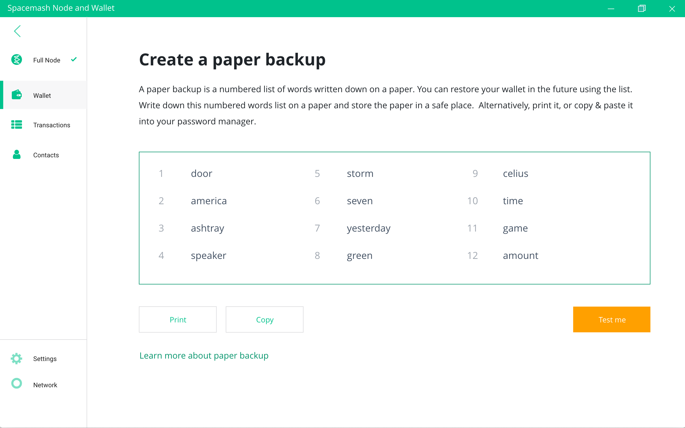
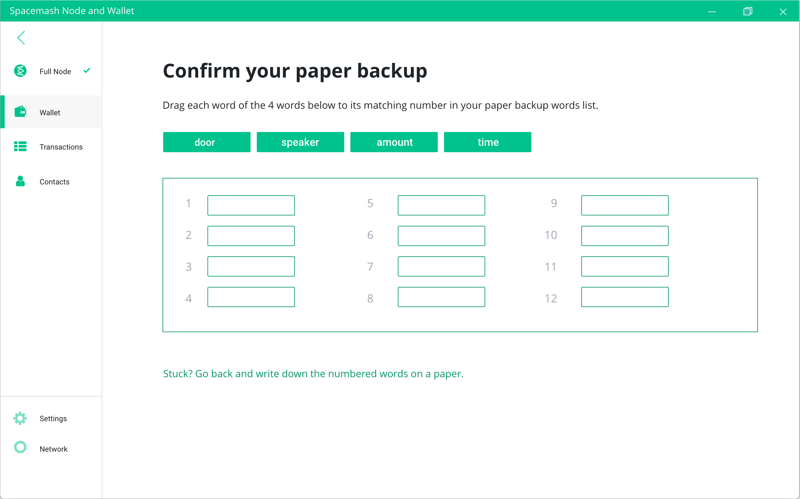
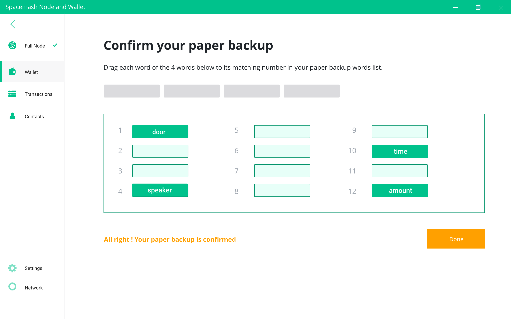
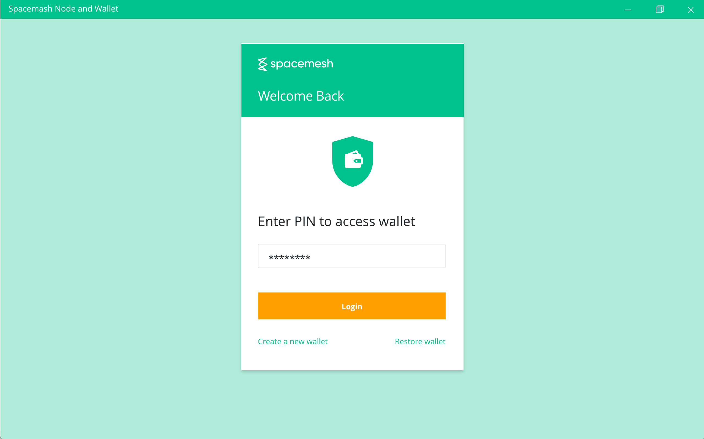

## Backing up
The are two main ways to backup your wallet, `File Backup` and `Phrases Backup`.

You will be prompted to backup your wallet until you backup it :-)

### Wallet File Backup
!> A file backup allows you to restore you wallet using the wallet file and your passphrase. You can't restore your wallet without having the file and remember your passphrase.

1. Click the `File Backup` option in the App backup options screen:

A window will open showing where the wallet file is stored on your hard-drive and the wallet file will be selected.

2. Copy the selected wallet file to a USB drive or to another hard drive.

We recommend saving the backup file to a USB drive and storing the drive in a safe place.

?> The sensitive data is stored encrypted in your wallet file as a security measure. So your Spacemesh Coin held in the wallet are safe even if someone gains access to the file. That said, please take care and make sure that access to your wallet backup is not provided to others. For example, do not save a backup on the cloud in a location that is accessible to anyone.

### 12 Words Backup

The phrases backup option allows you to save a list of 12 English words in a safe place. These phrases can be used to restore your wallet even in the case that you forget your wallet passphrase.

In this kind of backup, you print or write down a list of 12 English phrases.

!> Note that the order of the phrases in the list is important and you will need to provide these words in the same order to restore your wallet.

Follow these steps if you have a safe or a secure location for sensitive documents:
1. Click `Phrases Backup` in the backup options screen:

You should see this screen:

2. Write down or print the `12 words list` displayed on the screen
3. Store the paper with the words in a safe place such as a safe. Do not leave it next to your computer
4. Click on `Test Backup` and proceed to confirm you wrote down the words list:

!> Do NOT use your mobile phone camera to take a photo of your computer screen in order to save the words. As anyone with access to your photos will be able to steal your wallet coin balance.

If you don't have a safe or a secure location for private documents then follow these steps to store the phrases in your password manager app.

2. Click `Copy` to copy the words list to your clipboard from the paper backup screen
3. Open your password manager app and create a new item. e.g. My Main Wallet
4. Paste the copied words list into your item details or note
5. Click on `Test Backup` and proceed to verify that you have access to the printed words list:

Drag the 4 words displayed in the screen to their proper place in the list. e.g. if the word `door` is word 3 in the words list, then drag the word to slot number 3 in the empty list on the screen.

Once you dragged the 4 words into their correct place in the list click on `Done`.

## Restoring your Wallet from backup

### Restoring from a backup file
1. Open the App and when prompted to secure a new wallet, click the `Restore Wallet` button:

2. When prompted, click the `Restore from backup File` option

!> TODO: Add screen shot here.

A standard file open dialogue box is displayed.

!> TODO: Add screen shot here.

3. Locate your wallet file backup in the file dialogue box

4. Enter your wallet passphrase when prompted in this screen:

?> Forgot your wallet passphrase? The only way to restore it is using your 12 words list backup.

?> You can also access the restore wallet command from the app settings screen.

Congratulations! your wallet is now restored from the backup file.

### Restoring from a 12 words list
1. Open the App and when prompted to secure a new wallet, click the `Restore Wallet` button

2. When prompted, click the `Restore from 12 words list` button

!> TODO: Add screen shot here.

3. Enter the 12 words from paper or from your password manager item in the same order you wrote them down

!> TODO: Add screen shot here.

Congratulations! your wallet is now restored from your 12 words list backup
