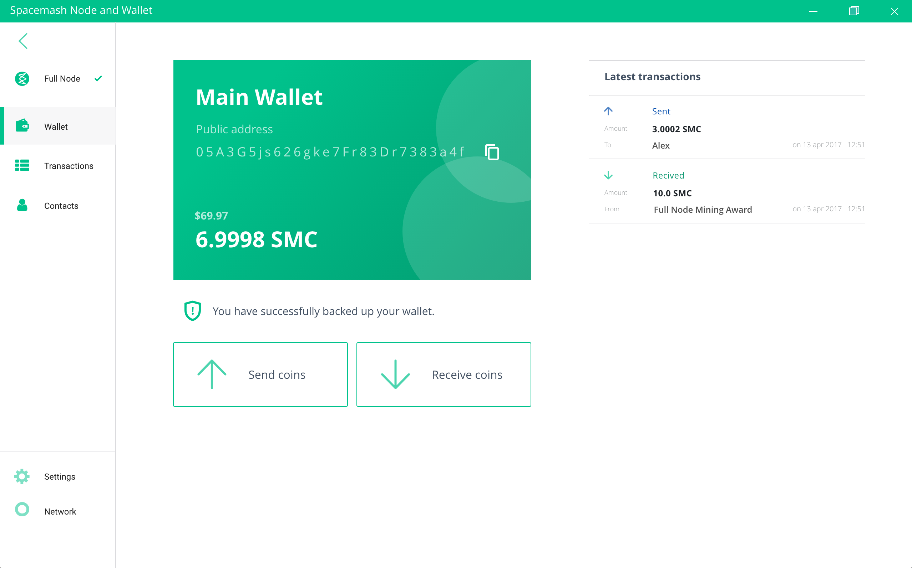
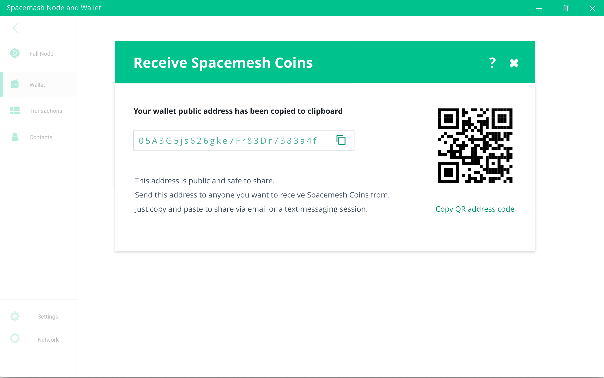

# Getting Coin

There are 3 ways to get Testnet Spacemesh Coins:

1. Run a full node and receive protocol participation [awards](awards.md) from minted coins

2. Get coins from [the tap chatboat](tap.md)

3. Get coins sent by another person to your address

## Getting coins from another person

1. Click on the `Receive Coins` button in your wallet screen:

2. Click on the copy button to copy your public address to the clipboard:

3. Paste the copied address in a chat window with the person you'd like to receive coins from and ask her to use her Spacemesh wallet to send coins to this address

Once the coins were sent to you, you should see the transaction in the `Latest Transactions` section of your wallet screen, and your address coin balance should be updated to include the received coins.

