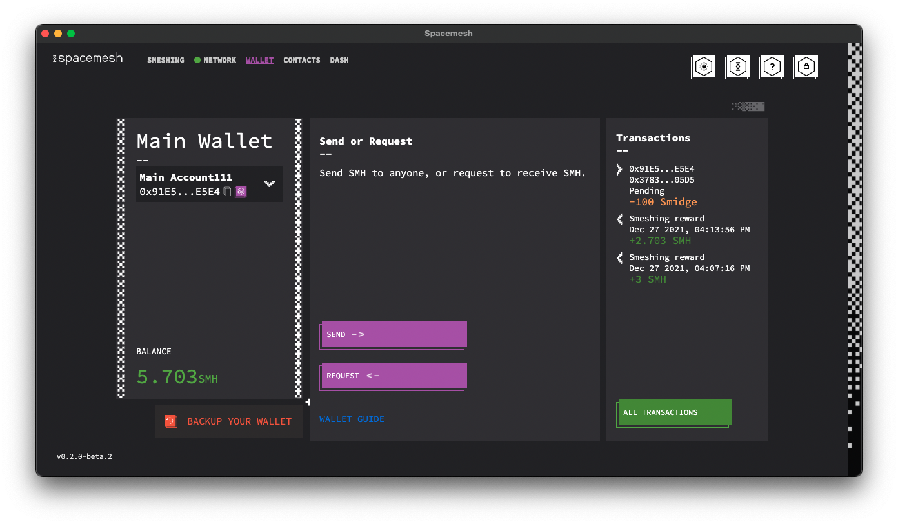
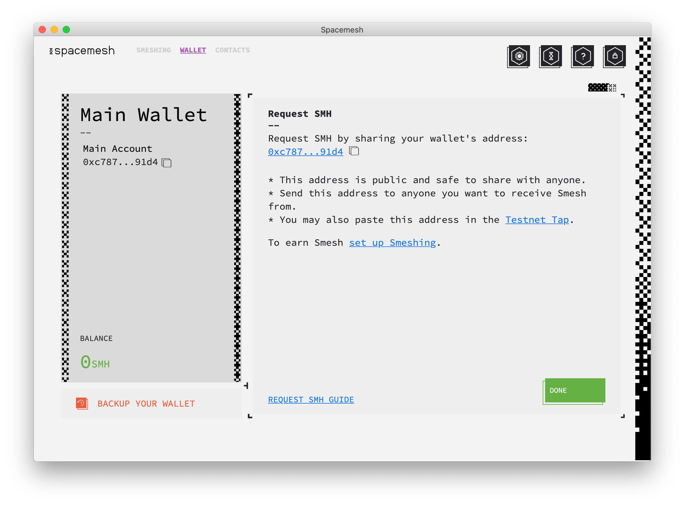

# Getting Testnet Smesh

There are 3 ways to get Testnet Smesh:
1. Earn smeshing rewards. Follow [this guide](rewards.md) to set up smeshing.
2. Get Smesh from the [Spacemesh Tap](https://discord.gg/ASpy52C).
3. Get Smesh sent from another account to your account in a transaction.

---
## Getting Smesh from the Tap

1. Click on the `REQUEST SMESH` button in your wallet screen:

You should see this screen:

2. Click on the `copy button` next to your `account public address` to copy it public address to the clipboard.

3. Join the [Testnet tap channel](https://discord.gg/ASpy52C) on the Discord.

4. Send a message to the channel with the address you copied. To do so, paste the copied address into the new message text field and click `send`.

---

## Getting Smesh from another account

### About Accounts and Addresses
By default, your Spacemesh Wallet has one main account. That account has one public address you can share with anyone in order to receive Smesh.

1. Click on the `REQUEST SMESH` button in your wallet screen:

You should see this screen:

2. Click on the `copy button` next to your `account public address` to copy it public address to the clipboard.

3. Paste the copied address into a text chat session with the person you'd like to receive Smesh such in a chat app such as Whatsapp, Signal or Telegram.

4. Ask that person to send Smesh to this address using his or her Spacemesh wallet.

> Once Smesh are sent to you, you should see the transaction in the `Transactions` section of your wallet screen, and your account Smesh balance should be updated to include the received Smesh.

Congratulations! you have successfully received Smesh from another account to your account!
