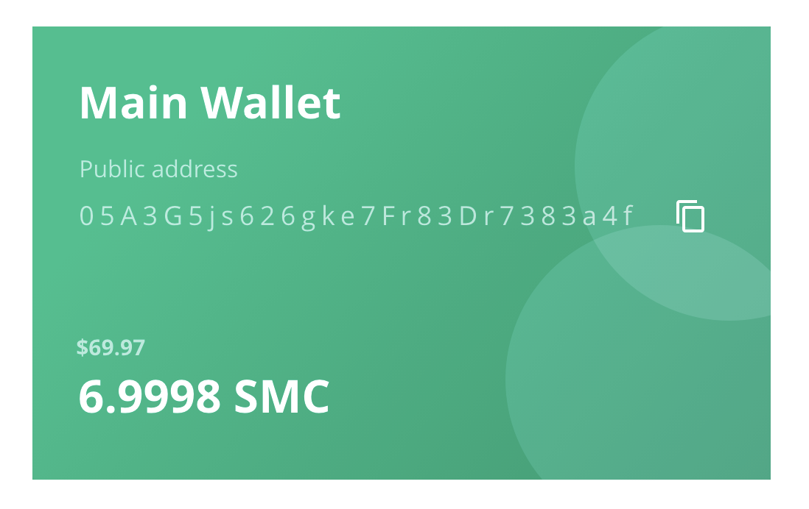

# Installing and Running

Follow this guide to download, install and run a full Spacemesh Testnet p2p node on your desktop computer.

## Step 1 - Downloading the Installer

The Spacemesh App includes the Spacemesh p2p node, a basic wallet and a p2p node dashboard. You install the App to setup your p2p node and you use the wallet to setup an award account for your p2p node.

First, please confirm that your system meets the [minimum system requirements](requirements.md).

Next download the App installer for your OS.

### OS X

> [SPACEMESH_OS_X_INSTALLER](setup.app)
  **SHA512 Checksum**
1b6d41e893868aab9e06e78a9902b925227c82d8e31978ff2c412c18ac99f49f7035471544 1385e0b96e4bd3e861d18fb30433d52e12b15b501fa790f36d0ea0

### Windows 10

> [SPACEMESH_WIN10_INSTALLER](setup.app)
  **SHA512 checksum**
1b6d41e893868aab9e06e78a9902b925227c82d8e31978ff2c412c18ac99f49f7035471544 1385e0b96e4bd3e861d18fb30433d52e12b15b501fa790f36d0ea0

## Debian Linux

?> Debian 8 or newer is supported

> [SPACEMESH_DEB_INSTALLER](setup.deb)
  **SHA512 Checksum**
1b6d41e893868aab9e06e78a9902b925227c82d8e31978ff2c412c18ac99f49f7035471544 1385e0b96e4bd3e861d18fb30433d52e12b15b501fa790f36d0ea0

### Ubuntu or Fedora Linux

?> Ubuntu 12.04 or newer and Fedora 21 or newer are supported

> [SPACEMESH_UBUNTU_INSTALLER](setup.pkg)
  **SHA512 Checksum**
1b6d41e893868aab9e06e78a9902b925227c82d8e31978ff2c412c18ac99f49f7035471544 1385e0b96e4bd3e861d18fb30433d52e12b15b501fa790f36d0ea0

### Other Flavors of Linux

?> Running a linux distribution that doesn't support Electron apps? We got you covered! Just follow [this guide](linux.md) to join the Testnet from your system.

---
### Security Note
The installer you are downloading was packaged from code in the [Spacemesh open source software repos](https://github.com/spacemeshos) on github and all software released by Spacemesh is 100% open source.

We provide these installers to make it convenient for non-developers users to join Spacemesh.

If you prefer and technically able, you can build and run the installer [directly from source code](soruce.md) instead of using the provided installer.

---

## Step 2 - Running the App

First, optional but recommended! follow [these steps](auth.md) to verify that the Installer you have downloaded is authentic and not compromised by a 3rd party.

### OS X
Locate the installer you have downloaded in Finder and double-click it.

### Windows 10
Locate the installer you have downloaded in Explorer and double-click it.

### Debian Ubuntu or Fedora Linux
Locate the installer you have downloaded and run it.

---

## Step 3 - Creating a Wallet

You should now see the app's welcome screen.

You will now setup a new wallet to manage your Spacemesh Coins and to provide your full node with a `coins awards address`.

?> A `coins awards address` is where you receive Spacemesh Coins for running a full node.

You also use your wallet to send coin to anyone and to receive coins from anyone.

Click `Start Setup`.

The App prompts you to enter a passphrase to protect your new wallet. Proceed to choose a passphrase and to confirm it.

!> You will need to use the passphrase to access your wallet after you close the App. We recommend that you'll save your passphrase in your computer's secure password manager.

!> Until you backup your wallet, you will not be able to access it without your passphrase. There is no way to restore a wallet that wasn't backed-up if you forget your passphrase.

### About your Wallet

Your new main wallet is configured with a new `default address`. Each address has Spacemesh Coin balance that you can spend.

You can create additional addresses later, but for now, you will use this address as the address for coin awards that will be awarded to you for running a full node on your computer.

Coin awards will appear in the balance of this address in your wallet.

The setup automatically configures your full node with your `default address`. You can change the full node award address later and at any time in the App.

---

## Well Done!
Now that you have a new wallet and a new `default address`, you are ready to [setup your Spacemesh full node...](guide/setup.md)
