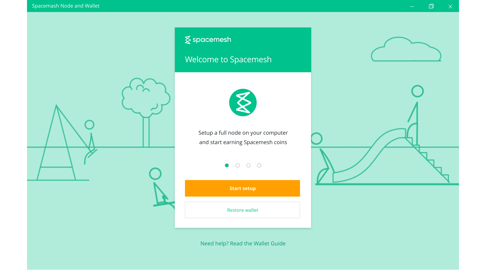
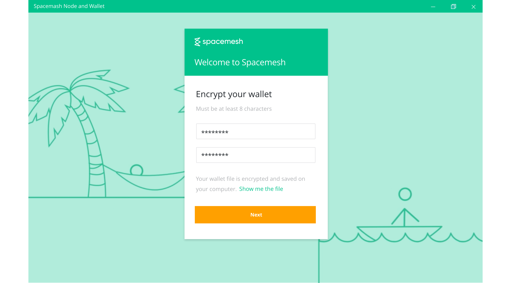

# Installing and Running

Follow this guide to download, install and run a full Spacemesh Testnet p2p node on your desktop computer.

## Step 1 - Downloading the Installer

The Spacemesh App includes the Spacemesh p2p node, a basic wallet and a p2p node dashboard. You install the App to setup your p2p node and you use the wallet to setup an award account for your p2p node.

First, please confirm that your system meets the [minimum system requirements](requirements.md).

Next download the App installer for your OS.

### OS X

> [SPACEMESH_INSTALLER](setup.app)
  **SHA512 checksum**
1b6d41e893868aab9e06e78a9902b925227c82d8e31978ff2c412c18ac99f49f7035471544 1385e0b96e4bd3e861d18fb30433d52e12b15b501fa790f36d0ea0

### Windows 10

> [SPACEMESH_INSTALLER](setup.app)
  **SHA512 checksum**
1b6d41e893868aab9e06e78a9902b925227c82d8e31978ff2c412c18ac99f49f7035471544 1385e0b96e4bd3e861d18fb30433d52e12b15b501fa790f36d0ea0

### Ubuntu, Fedora or Debian Linux

?> Ubuntu 12.04 and newer, Fedora 21 and Debian 8 distributions are supported

> [SPACEMESH_INSTALLER](setup.app)
  **SHA512 checksum**
1b6d41e893868aab9e06e78a9902b925227c82d8e31978ff2c412c18ac99f49f7035471544 1385e0b96e4bd3e861d18fb30433d52e12b15b501fa790f36d0ea0

### Other Flavors of Linux

> Running a linux distribution that doesn't support Electron apps? We got you covered! Just follow [this guide](linux.md) to join the Testnet from your system.

---
### Security Note
The installer you are downloading was packaged from code in the [Spacemesh open source software repos](https://github.com/spacemeshos) on github and all software released by Spacemesh is 100% open source.

We provide these installers to make it convenient for non-developers users to join Spacemesh.

If you prefer and technically able, you can build and run the installer [directly from source code](soruce.md) instead of using the provided installer.

---

## Step 2 - Running the App

First, optional but recommended! follow [these steps](auth.md) to verify that the Installer you have downloaded is authentic and not compromised by a 3rd party.

### OS X
Locate the installer you have downloaded in Finder and double click it. Follow the on-screen instructions.

### Windows 10
Locate the installer you have downloaded in Explorer and double click it. Follow the on-screen instructions.

### Linux (Debian, etc.. with UI)
todo: add instructions here...

---

## Step 3 - Creating a Wallet

Click `Start Setup` in the welcome screen.

?> You need a wallet to manage your Spacemesh Coins and to provide the platform with an address to award Spacemesh coins to you for participation in the platform by running a full p2p node. You also use the wallet to transfer coin to other people. You create a wallet in the Spacemesh App.

### Protect your wallet with a passphrase

The Spacemesh App will prompt you to enter a passphrase to protect your new wallet - proceed and choose a password. You will need to use the passphrase to open your wallet in future app sessions. We recommend that you'll save your passphrase in your computer secure password manager.

!> Important: until you backup your wallet from the app, you won't be able to access it without your passphrase. There is no way to restore a wallet that wasn't backed-up in case you forget your passphrase.

#### About your Wallet

Your new wallet is configured with a new default address. You can create additional addresses later, but for now, you will use this address as the address for coin awards that are due to your p2p node.

Coin awards you get due to running a full node will appear as a coin balance for this address.

The setup automatically configures your

---

## Well Done!
Now that you have a new wallet, you are ready to [setup your Spacemesh p2p node...](guide/setup.md)
