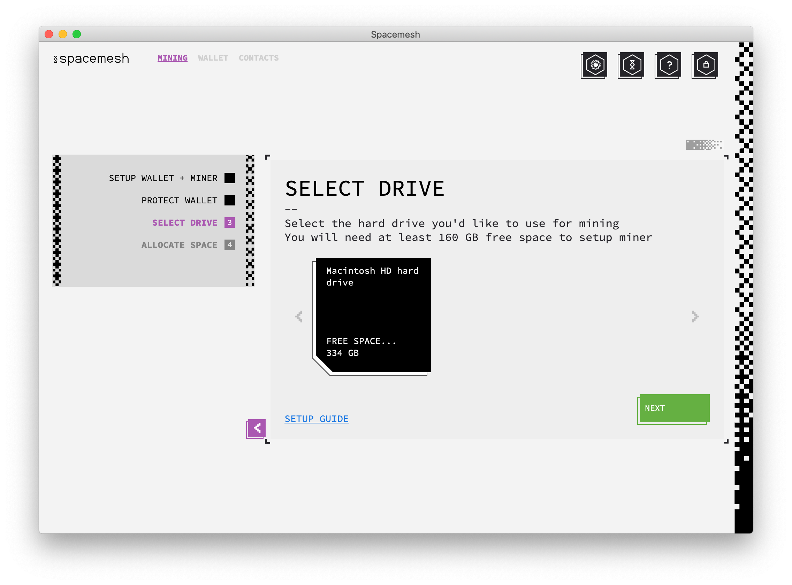
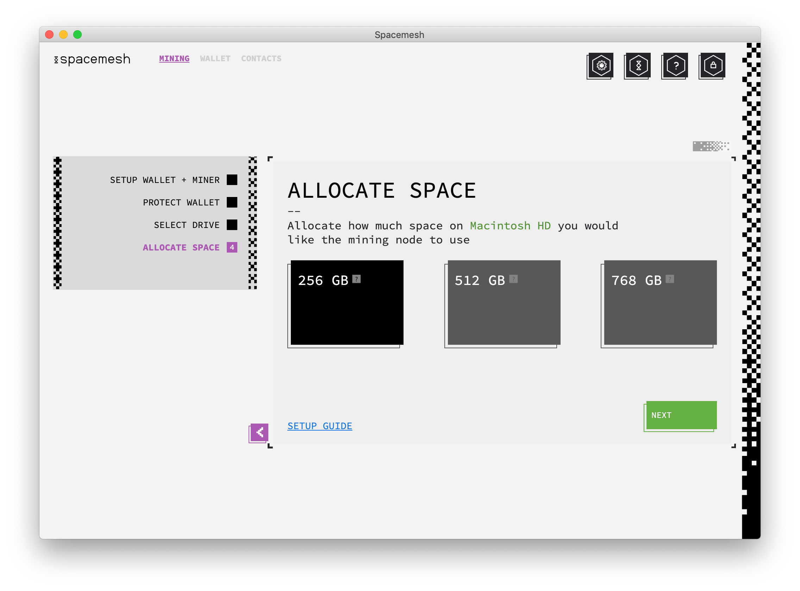

# Setup Wallet + Mining

## Step 1 - Wallet Setup
Follow the installer on-screen instruction and proceed to launch the app. You should now see this welcome screen:

Let's now proceed to setup the Spacemesh full p2p node, the mining process, and the Spacemesh Coins Wallet. But first, some definitions.

## About the Spacemesh Wallet
> A wallet holds one or more coin accounts. An account is identified by a long unique number such as `0x20a5...3a1f`. The wallet enables you to send and receive Spacemesh Coins and in the future, will enable you to run decentralized applications. Each account has a Spacemesh coin balance. You can send coins from your account up to your coin balance.

Let's now setup a new wallet to manage your Spacemesh Coins and provide your full p2p node with a `Coins Awards Account`.

> A `Coins Awards Account` is a wallet account you setup and use to receive Spacemesh Coins for running a Spacemesh full p2p node.

When setting up a full p2p node, your wallet's main account will be used as the `Coins Awards Account` for this full node.

?> Note that you can skip the full p2p node and the mining setup and run the Spacemesh App in `wallet-only mode`. This is useful if you only want to transact with Spacemesh Coins on your laptop when, for example, you run a Spacemesh full p2p node in the Spacemesh App on your desktop. See [this guide](wallet_mode.md) for more info about this configuration.

---

Click on `SETUP` to start the setup process.

The next screen should look like this:

The App prompts you to enter a password to protect the access to your new wallet to your full p2p node. Proceed by choosing a password (8 or more characters) and confirming it.

> You will need to use the newly created password to access your wallet after you have locked the access to the App. We recommend saving the password in a password manager such as 1Password.

> Until you back up your wallet using the 12 words backup method, you will not be able to access it without your password. There is no way to restore a wallet that wasn't backed up if the password has been forgotten.

---

Click `NEXT`. You should now see this screen:

## Step 2 - Mining Setup

## About Spacemesh Mining
Spacemesh is using a novel consensus protocol. Instead of constantly solving computational puzzles with your CPU while you participate in a blockchain, it utilizes free space on your hard drive, following a one-time setup phase.

The storage you commit to Spacemesh is attached to your identity on the Spacemesh computer. It determines your identity eligibility to submit blocks with transactions to the Spacemesh blockmesh and to receive awards for block submission. The more free disk space you commit, the more frequently you will receive Spacemesh coin awards.

This setup is a one-time process that enables Spacemesh to reach consensus on a distributed ledger without using proof-of-work or proof-of-stake algorithms.

The free space you commit to your full node is not used to store any useful data files. It will be filled with cryptographic data that is only used to establish your node identity and your coin awards eligibility.

---

The Spacemesh App now prompts you to setup mining on your computer.

You need to specify which hard drive you would like to use for mining and how much storage you wish to allocate.

You should now see this screen:

Click on the hard drive that you would like to use for mining and click `NEXT`.

You should now see this screen:

Select the amount of free space you would like to allocate to Spacemesh and click `NEXT`.

> The more storage you allocate for Spacemesh on your drive, the higher your Spacemesh Coin awards will be.

> Note that for Spacemesh 0.1, the first release of the Testnet, you can only allocate a fixed-size of XXX GB to Spacemesh. In upcoming Testnet releases and for the Spacemesh Mainent, you will be able to determine how much space you would like to allocate. e.g. 250GB, 500Gb, 750GB, etc.

You should now see this screen:

> The one-time mining setup process has now begun, and it may take from 24 to 48 hours until it will complete, depending on your GPU capabilities. Do not turn off your computer until you get a notification about setup completion.

> The account currently selected in your wallet will be used as the `coins award address` for mining awards.

Click `GOT IT`.

---

## Step 3 - Desktop Computer Configuration

### Configure your Network
In order to participate in the Spacemesh network and earn mining awards you need to configure your computer firewall (and in some cases your home network router) to enable Spacemesh App to accept incoming Internet connections on TCP port 7153 and on UDP port 7153.

Please follow the instructions in [this guide](netconfig.md).

### Disable Computer Sleep Mode
To finish the one-time mining process and have your full node participate in the Spacemesh protocol so you can earn `Spacemesh Coins awards`, **you need to make sure that your desktop computer does not go to sleep or hibernates**.

Follow [this guide](no_sleep.md) to disable sleep on your computer.

## Next...
You are almost done! You are now ready to check your [Full Node Status](guide/status.md).
