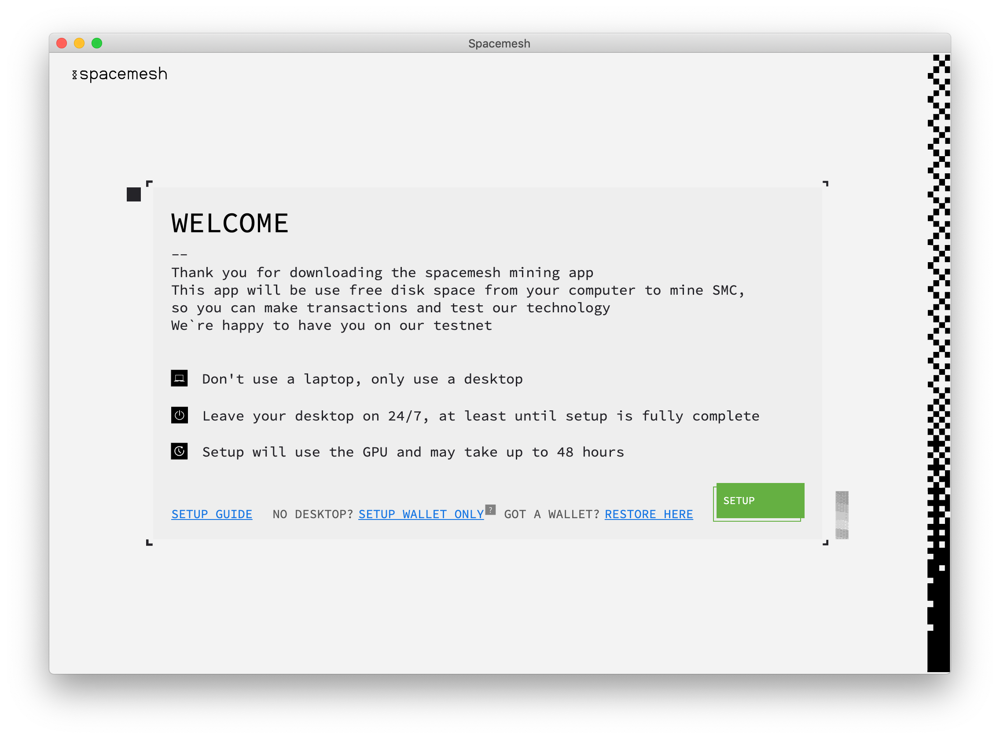
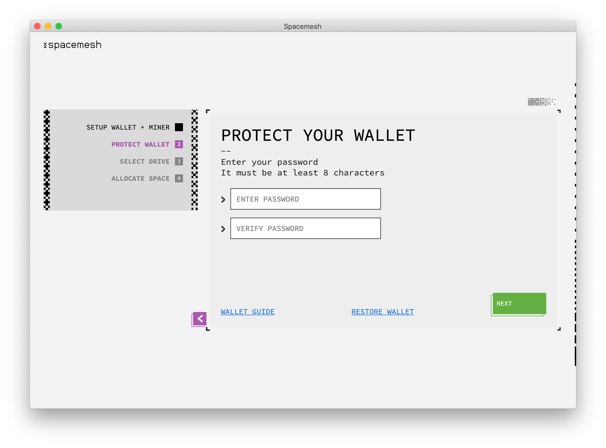
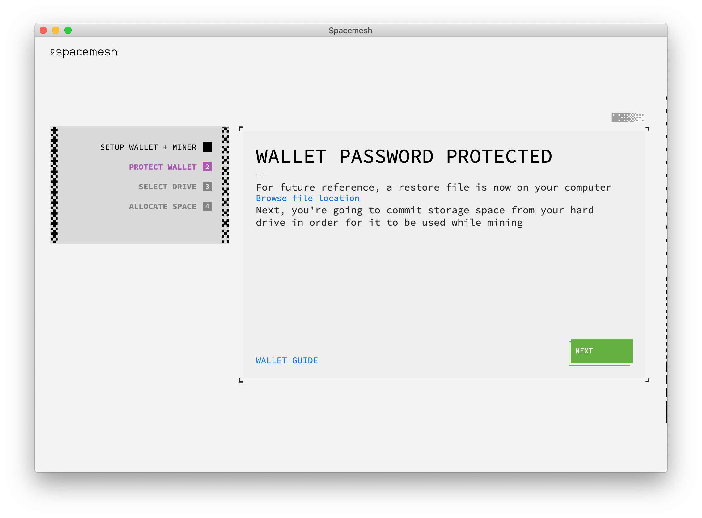
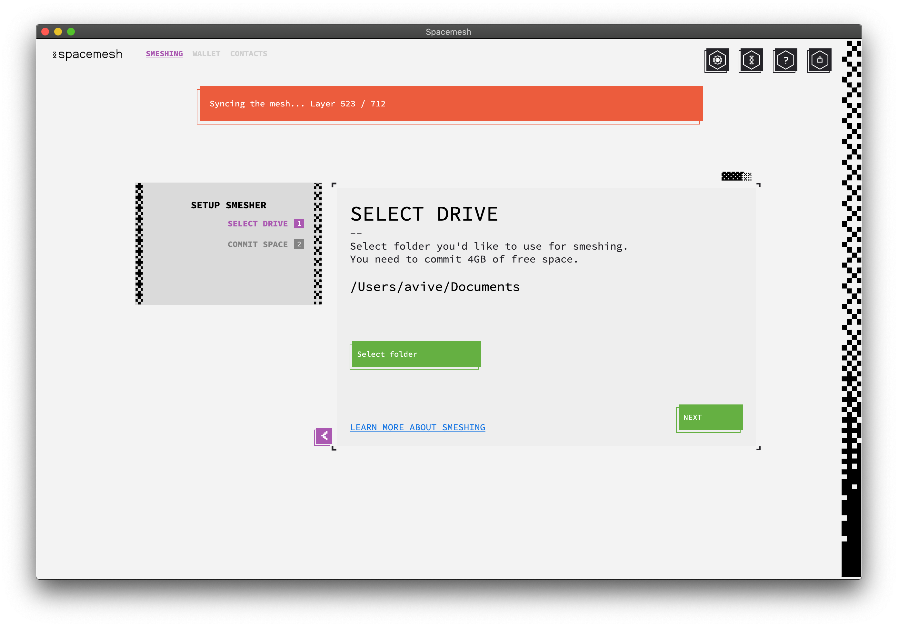
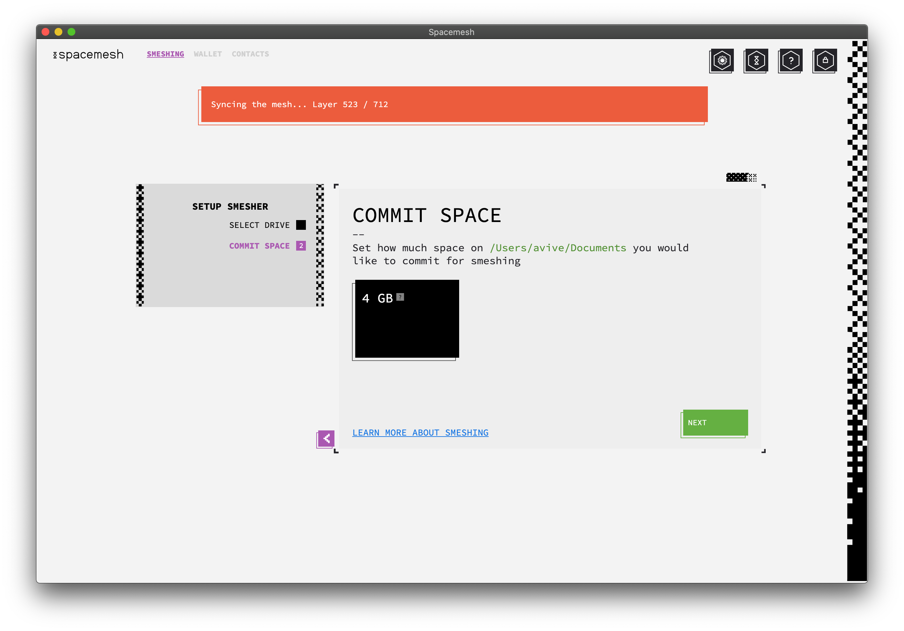
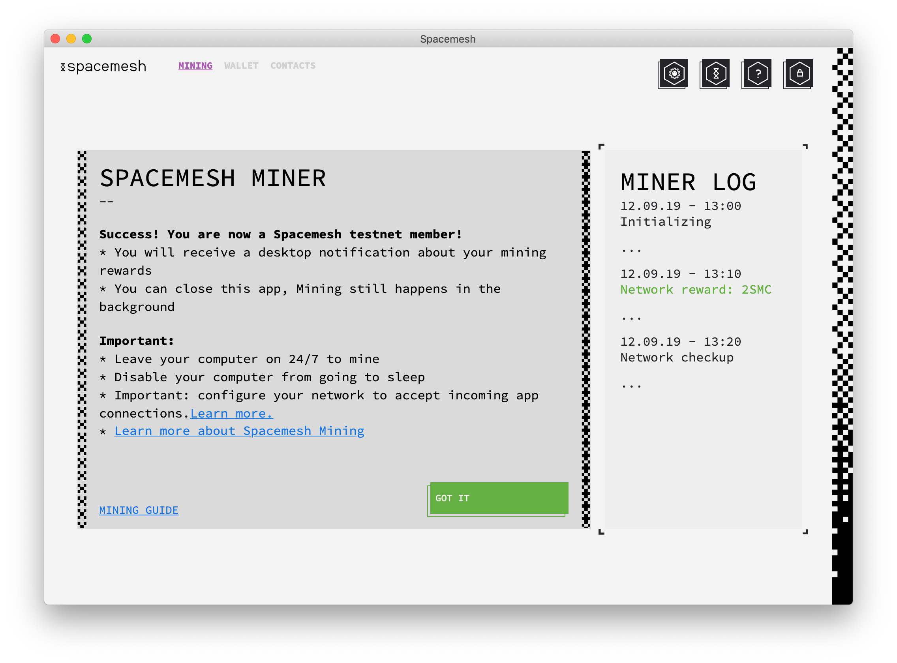

# Setting Up Wallet and Smesher

## Step 1 - Setting up a Wallet
Follow the installer's on-screen instruction and proceed to launch the app.

You should now see this welcome screen:

Let's now proceed to set up the Smesher, Smeshing, and the Wallet. But first, some definitions.

## About the Wallet

A wallet holds one or more Smesh accounts. An account is identified by a long, unique number, such as `0x20a5...3a1f`.

The wallet enables you to send and receive Smesh, and in the future, will enable you to run decentralized applications. Each account has a Smesh balance.

You can send Smesh from your account up to your coin balance. So for example, if your account coin balance is 10 Smesh then you can send up 10 Smesh from it to other accounts by executing transactions.

?> We call the Spacemesh full p2p node `Smesher`.

?> We call the process of producing blocks `smeshing`.

?> A `Rewards Account` is a wallet account you set up and use to receive Smesh for smeshing.

Your wallet's main account will be used as your Smesher's rewards account. You will receive rewards to this account.

Let's now set up a new wallet to manage your Smesh and provide your Smesher with a `Rewards Account`.

---

Click on `SETUP` to start the setup process.

The next screen should look like this:

The App prompts you to enter a password to protect access to your newly-created wallet and to your Smesher. Proceed by choosing a password (8 or more characters) and confirming it.

> You will need to use the newly-created password to access your Wallet after you have locked access to the App. We recommend saving the password in a password manager, such as [1Password](https://1password.com).

> Until you back up your Wallet using the 12 words backup method, you will not be able to access it without your password. There is no way to restore a wallet that wasn't backed up, if the password has been forgotten.

---

Click `NEXT`. You should now see this screen:

## Step 2 - Setting Up Your Smesher

## About Smeshing

Spacemesh uses a novel consensus protocol. Instead of constantly solving computational puzzles with your CPU while you participate in a blockchain, it utilizes free space on your hard drive, following a one-time setup phase.

The storage you commit to Spacemesh is attached to your identity on the Spacemesh decentralized ledger. It determines your eligibility to submit blocks with transactions to the Spacemesh Testnet and to receive rewards for your contribution. **The more free disk space you commit, the more frequently you will produce blocks and receive Smesh rewards.**

This one-time storage commitment enables Spacemesh to reach consensus on a distributed ledger without using proof-of-work or proof-of-stake algorithms.

> The free space you commit to your Smesher is not used to store any useful data. It will be filled with cryptographic data that is only used to establish your node identity and your block smeshing eligibility.

---

You should now see this screen:

The App prompts you to setup block smeshing on your computer. You need to specify the directory that you want Spacemesh to save your PoST init file.

Click `Select Folder` and locate a directory on one of your hard-drive.

You should now see this screen:

Select the amount of free space you would like to commit to Spacemesh and click `NEXT`.

> The more storage you allocate for Spacemesh on your drive, the higher your Smesh rewards will be.

> For Spacemesh 0.1, the first release of the App, you can only allocate a fixed-size of 4 GB to Spacemesh. In upcoming Testnet releases and for the Spacemesh Mainnet, the minimum setup will be 100GB and you will be able to determine how much space you would like to allocate, e.g., 100 GB, 200 GB, 300 GB, etc.

You should now see this screen:

> The one-time storage commitment setup process has now begun, and it may take from 30 minutes up to one hour to complete, depending on your CPU speed.

> Your CPU usage will go back to normal once the CPU-intensive setup is complete.

> Do not turn off your computer at least until you get a notification about setup completion.

> The account currently selected in your wallet will be used as the `Rewards Address` for block smeshing rewards.

Click `GOT IT`.

---

### Disable Computer Sleep Mode
To finish the one-time smeshing process and have your Smesher participate in the Spacemesh protocol so you can earn `Smeshing rewards`, **you need to make sure that your desktop computer does not go to sleep or hibernate**.

Follow [this guide](no_sleep.md) to disable sleep on your computer.

## Next...
You are almost done! You are now ready to check your [Smesher status](guide/status.md).
