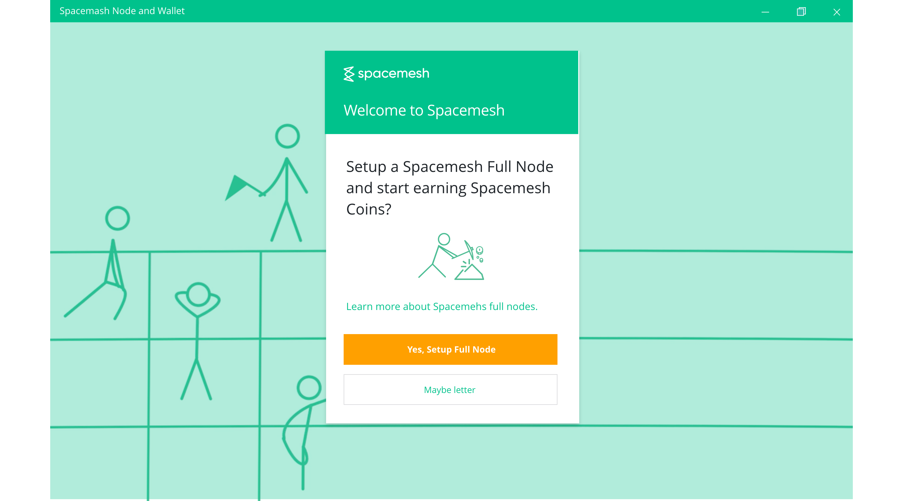
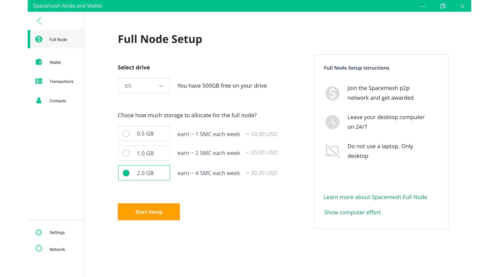

## Step 2 - Setup Wallet + Miner

Double-click the Spacemesh App Icon to launch it. You should now see this welcome screen:

Let's setup a Spacemesh Miner and Wallet.

> The Spacemesh Miner is a Spacemesh full p2p node which is configured to participate in consensus, maintain the Spacemesh coin ledger, and to earn awards for the participation.

> A wallet is where you manage accounts. A Spacemesh Account is identified by a long unique number such as `0x2012...0a1f`. It allows you to send and receive Spacemesh Coins.

Let's setup a new wallet to manage your Spacemesh Coins and to provide your Miner with a `coins awards account`.

?> A `coins awards account` is a wallet account you setup and use to receive Spacemesh Coins for running a Miner.

?> Note that you can skip the Miner setup and run the App in a `wallet-only mode`. This is useful if you only want to transact with Spacemesh Coins on your computer when, for example, you run a Miner on another computer. See this guide for more info about this configuration.

Click on `SETUP` to start the Miner + Wallet one-time setup process.

The next screen should look like this:

The App prompts you to enter a password to protect your new wallet and access to your Miner. Proceed to choose a password (8 or more characters) and to confirm it.

!> You need to use the password to access your wallet after you lock access to the App. We recommend that you'll save your password in your computer's secure password manager.

!> Until you backup your wallet, you will not be able to access it without your password. There is no way to restore a wallet that wasn't backed-up if you forget your password.

Click `NEXT`. You should now see this screen:

Click `NEXT` again

---

## Well Done!

Now that you have a new wallet and a new `default address`, you are ready to [setup your Spacemesh full node...](guide/setup.md)

# Setting up a Full Node

The Spacemesh App now prompts you to setup a full  node on your computer.

?> A `Spacemesh Full Node` is the software you run on your computer to join the Spacemesh global computer. This Spacemesh global computer is created from many p2p full nodes operated by people like you running Spacemesh on personal computers from all over the world. The nodes communicate with each other over the Internet to secure and maintain the Spacemesh Coin cryptocurrency and the Spacemesh computer state.

Click the orange `Setup` button and follow the on-screen instructions...

?> You can use the wallet features of the Spacemesh App without running a `Spacemesh Full Node` by clicking on `Maybe Later` when prompted to setup a node in the App. This is useful if you are running a full node on another computer and just want to view your coin balance or transact with Spacemesh Coins.

## Network Configuration
In order to participate in the Spacemesh network and earn mining awards your computer firewall (and in some cases your home network router) so the Spacemesh App is able to accept incoming Internet connections on port 7153 for both TCP and UDP.

Please follow the instructions in [this guide](netconfig.md).

## Storage Setup
Spacemesh is using a novel consensus protocol which instead of constantly solving computational puzzles with your CPU, is using a one-time setup phase that utilizes free space on your hard drive.

The storage you commit defines your identity on the Spacemesh computer and determines your awards eligibility.

The more free disk space you commit, the more frequent your Spacemesh coin award frequency will be.

This setup is a one-time operation that you only need to do once and it allows Spacemesh to reach consensus on a distributed ledger without using proof of work or proof of stake algorithms.

Follow the on-screen setup instructions to specify how much hard-drive free space you'd like to commit to your Spacemesh identity. Note that Spacemesh requires additional 10GB of free space for mesh data.

!> The free space you commit to your full node is not used store any useful data files. It is filled with cryptographic data by the setup process that is only used to establish your node identity and your awards eligibility according the Spacemesh consensus protocol rules.

Click 'Start Setup' to start the storage setup process. You should now see the setup progress screen...

You will get notified in this screen when the setup is complete and when you have been awarded Spacemesh coin for your participation in the platform.

Setup may take a while depending on your system hardware capabilities, but you should be able to use your computer as you normally do while setup is in progress.

!> Do not shut down your computer while the setup is in progress. If you do, you will need to restart the setup process.

?> You may minimize the App and access it again later or even close it by clicking on the main window close button and open it later. Your full node runs in the background even when the App is minimized or closed.

### Learning More about Proofs of Space Time
!> TODO: About proofs of space time... link to intro blog post here

!> TODO: Link to light paper blog post here...

## Next Step...
You are almost done! You are now ready to check your [Full Node Status](guide/status.md)
