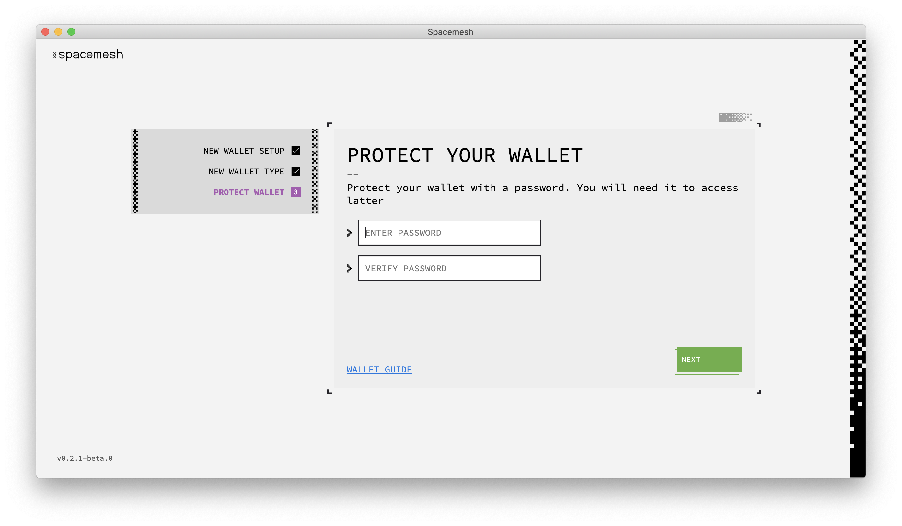

# Setting Up Wallet and Smesher

## Step 1 - Setting up a Wallet
Follow the installer's on-screen instruction and proceed to launch the App.

You should now see this welcome screen:

Let's now proceed to set up the Smesher, Smeshing, and the Wallet. But first, some definitions.

## About the Wallet

A Wallet holds one or more Smesh accounts. An account is identified by a long, unique hexidecimal number, such as `0x20a5...3a1f`.

The Wallet enables you to send and receive Smesh, and in the future, it will enable you to run decentralized applications (dapps) built on Spacemesh. Each account has a balance of Smesh coins (SMH).

You can send SMH from your account up to your coin balance. So for example, if your account coin balance is 10 SMH then you can send up 10 SMH from it to other accounts by executing transactions.

?> We call the Spacemesh full p2p node a _Smesher._

?> We call the process of producing blocks _Smeshing._

?> A _Rewards Account_ is a wallet account you set up and use to receive Smesh coins in exchange for Smeshing.

Your wallet's main account will be used as your Smesher's rewards account. You will receive rewards to this account.

Let's now set up a new wallet to manage your Smesh and provide your Smesher with a `Rewards Account`.

---

Click on `SETUP` to start the setup process.

The next screen should look like this:

The App prompts you to enter a password to protect access to your newly-created wallet and to your Smesher. Proceed by choosing a password (8 or more characters) and confirming it.

> You will need to use the newly-created password to access your Wallet after you have locked access to the App. We recommend saving the password in a password manager, such as [1Password](https://1password.com).

> Until you back up your Wallet using the 12 words backup method, you will not be able to access it without your password. **There is no way to restore a wallet that wasn't backed up, if the password has been forgotten.**

Click `NEXT`. You should now see this screen:

## Step 2 - Setting Up Your Smesher

## About Smeshing

Spacemesh uses a novel consensus protocol. Instead of constantly solving computational puzzles with your CPU while you participate in a blockchain, as in Proof of Work, it utilizes free space on your hard drive, following a one-time setup phase.

The storage you commit to Spacemesh is attached to your identity on the Spacemesh decentralized ledger. It determines your eligibility to submit blocks with transactions to the Spacemesh Testnet and to receive rewards for your contribution. **The more free disk space you commit, the more frequently you will produce blocks and receive Smesh rewards.**

This one-time storage commitment enables Spacemesh to reach consensus on a distributed ledger without using Proof-of-Work or Proof-of-Stake algorithms.

> The free space you commit to your Smesher is not used to store any useful data. It will be filled with cryptographic data that is only used to establish your node identity and your block Smeshing eligibility.

You should now see this screen:

The App prompts you to set up block Smeshing on your computer. You need to specify the directory that you want Spacemesh to save your PoST init file.

Click `Select Folder` and locate a directory on one of your hard drives. Click `NEXT`.

You should now see this screen:

Select the amount of free space you would like to commit to Spacemesh and click `NEXT`.

> The more storage you allocate for Spacemesh on your drive, the higher your Smesh rewards will be.

> During this stage of Testnet 0.2, you can only allocate up to 4kb.

You should now see this screen, prompting you to choose your preferred method of POS data generation.

Once you've chosen, click `NEXT`.

This will bring you to a confirmation screen. If everything is as you like it, click `CREATE DATA`.

And finally, you should end up here:

The one-time storage commitment setup process has now begun. At this stage, due to the small size, it should only take a moment.

> Do not turn off your computer before you get a notification about setup completion.

> The account currently selected in your wallet will be used as the `Rewards Address` for block smeshing rewards.

Click `GOT IT`.

---

### Disable Computer Sleep Mode
To finish the one-time Smeshing process and have your Smesher participate in the Spacemesh protocol so you can earn `Smeshing rewards`, **you need to make sure that your desktop computer does not go to sleep or hibernate**.

## Windows 10

1. Type `Power` in the taskbar search box and click on `Power & sleep settings` in the results.
2. Navigate to the drop-down titled `When plugged in, PC goes to sleep after` and chose `Never` from the drop-down.

## OS X

1. Open the `System Preferences` control panel and click on `Energy Saver`.
2. Click on the `Power Adapter` tab if you see one.
3. Check the checkbox labeled `Prevent computer from sleeping automatically when the display is off`.

---

## Linux

Please refer to the Power Settings, Hibernation and Sleep topics in your Linux distribution documentation.
