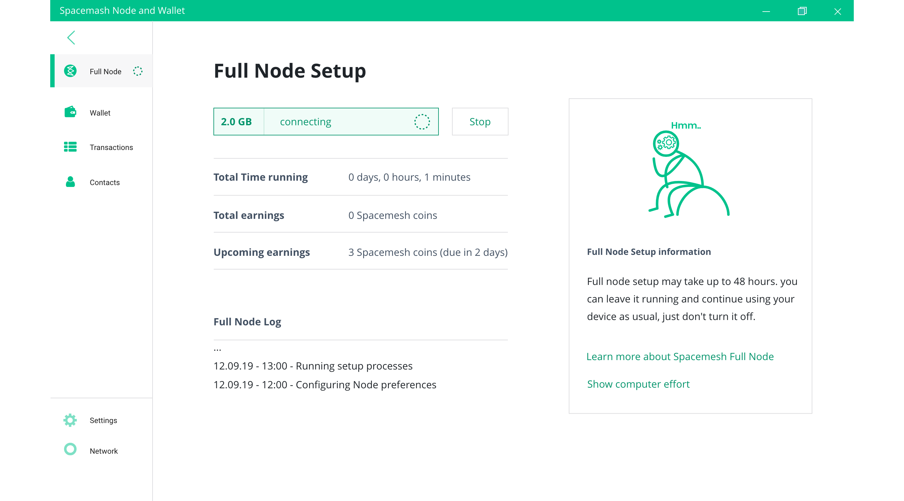
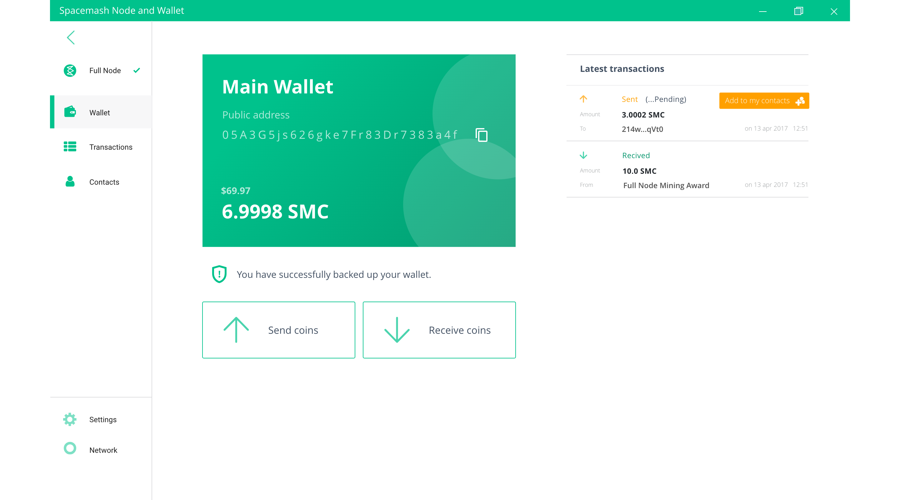

# Checking Status

When the initial setup is done you should see this screen:

You view your full node status in the full node screen in the app.

Click on the Wallet command to switch to the Wallet screen and view your current coin balance and default address...

You may now close the App. Your full node will keep running the background. Open the App again to access your wallet, view your full node status, to send Spacemesh coins to anyone or to receive Spacemesh Coins from anyone.

## That's all folks!

You did it - you are now up and running a Spacemesh full node, and you will start receiving coin awards for contributing to the Spacemesh platform.

?> Remember to leave your computer open 24x7 to fully participate in the Spacemesh platform and to win coin awards for your contributions.

## What to do next?

Follow these tutorials to become a Spacemesh master:

- Check your [Spacemesh Coin balance](balance.md)
- [Pay someone](pay.md) with Spacemesh coins
- [Get paid](getting_paid.md) with Spacemesh coins
- [Backup up your wallet](backup.md)
- [Sending coin](transacting.md) to a friend...
- Can't wait for your award? [Get some Testnet coins](tap.md) from our chat bot

## Join our Community
Stuck? Needs additional info? Got some cool ideas for the project?
- Join the conversation in our [Testnet chat channel](https://gitter.im/spacemesh-os/testnet)
- Get answers and ask questions in our [Testnet community forum](https://community.spacemesh.io)
- Follow [Spacemesh on Twitter](https://twitter.com/teamspacemesh)
- Learn about Spacemesh on Spacemesh.io

## Advanced Scenarios
- [Build and run](build.md) from source code
- Run a full node on a [console-only linux system](linux.md)
- Run a full node in a [Docker container](docker.md)
