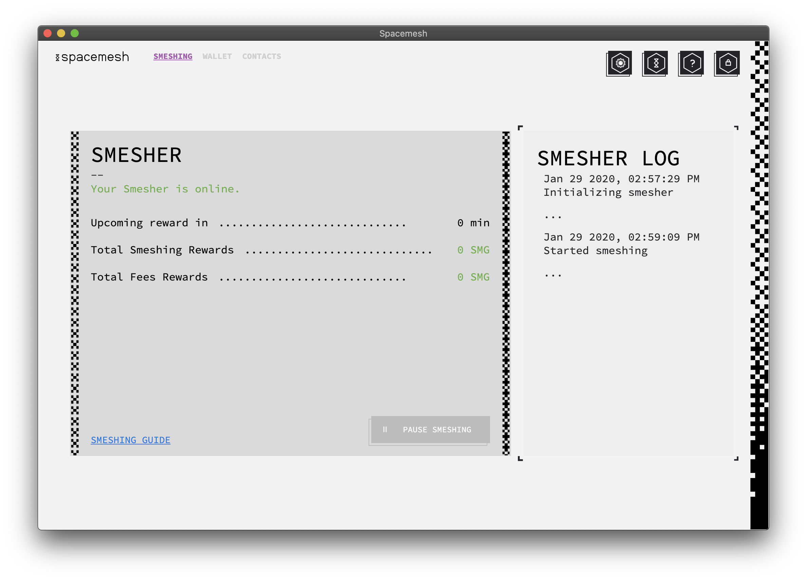

# Checking Status

Open the App if it is not already open and click on the 'MINING' tab on the top-left of the main window.

You should now see the mining status screen:

You track your full node operation and check your full node participation coin awards on this screen. You can also pause (or unpause) your full node by clicking on the 'PAUSE MINING' button.

Click the close button in the App man Window.

You will be prompted to quit the app or to switch it to running in the background. Choose `Keep running in background` so mining and your full node keeps running.

## Well Done!
You did it - you are now up and running a Spacemesh full node, and you will start receiving coin awards for contributing to the Spacemesh platform.

?> Remember to leave your computer open 24x7 to fully participate in the Spacemesh platform and to win coin awards for your contribution.

## Doing More With the Spacemesh App

Follow these guides to become a Spacemesh maestro:

- [Pay someone](send_coin.md) with Spacemesh coins
- [Get paid](get_coin.md) with Spacemesh coins
- Do more with [your wallet](wallet.md)
- Can't wait for your award? [Get some Testnet coins](tap.md) from our chat bot

## Join our Community
Stuck? Needs additional info? Got some cool ideas for the project?
- Join the conversation in our [Testnet  Chat channel](https://discord.gg/ASpy52C) on Discord
- Get answers and ask questions in our [Testnet community forum](https://community.spacemesh.io)
- Follow [Spacemesh on Twitter](https://twitter.com/teamspacemesh)
- Learn more about Spacemesh on [Spacemesh.io](https://spacemesh.io)
