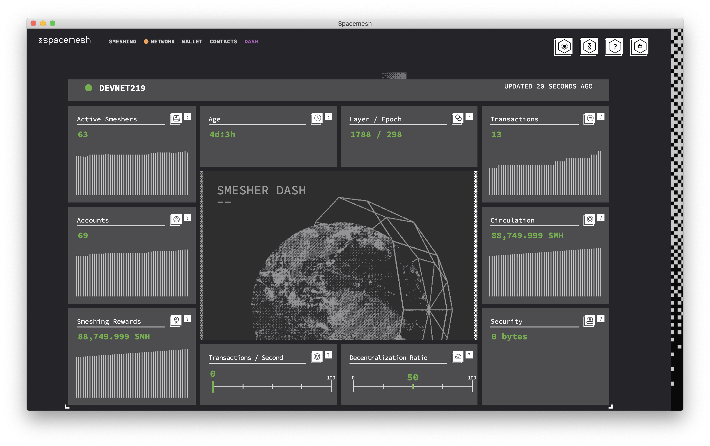

# Network & Dashboard

Smapp 0.2 now has the Network and Dashboard screens, which allow you to check the status of your node and the network at large.

# Network Screen

The Network screen allows you to check the status of your node. Here you will find the name of the network, its age, your syncing status, layer information, your connection type, and the number of peers you're connected to.  

## Accessing your logs

Your Smapp logs are useful for debugging, and the team may ask you to share them in the event that you run into a bug. You can access these logs by clicking `BROWSE LOG FILE` at the bottom of your Network Screen.

# Dashboard

The Dashboard screen gives you live information about the network at large.

