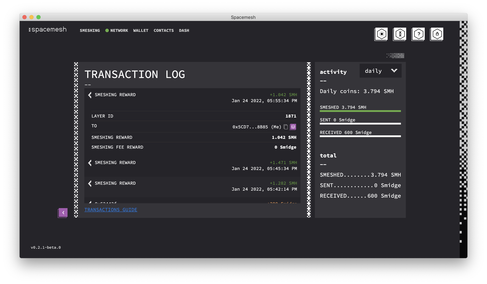

# Smesh Rewards

## Overview
Users who run the Smesher in the App and submit blocks to the network are entitled to Smesh rewards.

After setting up smeshing on your computer you will get your first reward in about 49 hours. After this, you will begin receiving a reward at least once a day.

Your exact number of daily rewards, and each reward amount, depends on how many Smeshers added blocks to the mesh in that time period. Therefore, your daily reward will vary.

Read on for a more detailed technical explanation.

## Rewards Accounts

Smesh rewards appear in the main Wallet account that you created in the Spacemesh App prior to setting up Smeshing.

This account is associated with your Smesher's identity and is called the _Rewards Account_ (aka, the _coinbase account)._

## Layers, Epochs and Blocks

In Spacemesh, blocks with transactions are added into `layers`.

In the Spacemesh 0.1 Testnet, every layer has a constant duration of five minutes.

Layers are numbered. The first layer after the Testnet goes live is labeled `layer 0`, the next one `layer 1`, etc...

An `epoch` is a fixed number of layers. Each Testnet epoch has 288 layers and is 24 hours long. So, `Epoch 0` is the first 288 layers starting with `layer 0` and its last layer is `layer 287`, and `Epoch 1` start in `Layer 288` and ends with `Layer 575`.

Your eligibility to contribute blocks to a specific layer is determined by the Spacemesh protocol, and automatically executed by the App.

The Spacemesh protocol guarantees that you will be eligible to submit at least one block in at least one layer in each and every epoch, once you have completed setting up your Smesher and as long as your App is running on your computer.

## Layer Rewards
Each layer has a total reward of 50 SMH. This reward is distributed to the rewards account of each miner who contributed at least one block to that layer.

So, for example, if a layer includes 10 blocks, each submitted by a different Smesher, 50 SMH will be distributed evenly among the reward accounts of each of the 10 participating Smeshers. So each account will be credited with 5 SMH.

Rewards for a layer are distributed to reward accounts 4 layers (i.e., 20 minutes) after that layer.

## Transaction Fees
In addition to the layer reward described above, all Smeshers which submitted at least one block to a layer are entitled to a share of the transaction fees of valid transactions included in blocks in that layer.

The transaction fees in a layer are evenly distributed to all the Smeshers who have submitted a block in the layer (think of it like the wait staff in a restaurant pooling tips).

## Tracking your Rewards

To view your rewards, click on `ALL TRANSACTIONS` in the Wallet screen. Rewards appear as special transactions in the transaction log:

## Summary

A fixed amount of SMH called the _layer reward_ is evenly distributed among all Smeshers which contributed a block to the layer.

The transaction fees of transactions included in a layer are evenly distributed among all the Smeshers that contributed a block to that layer.
