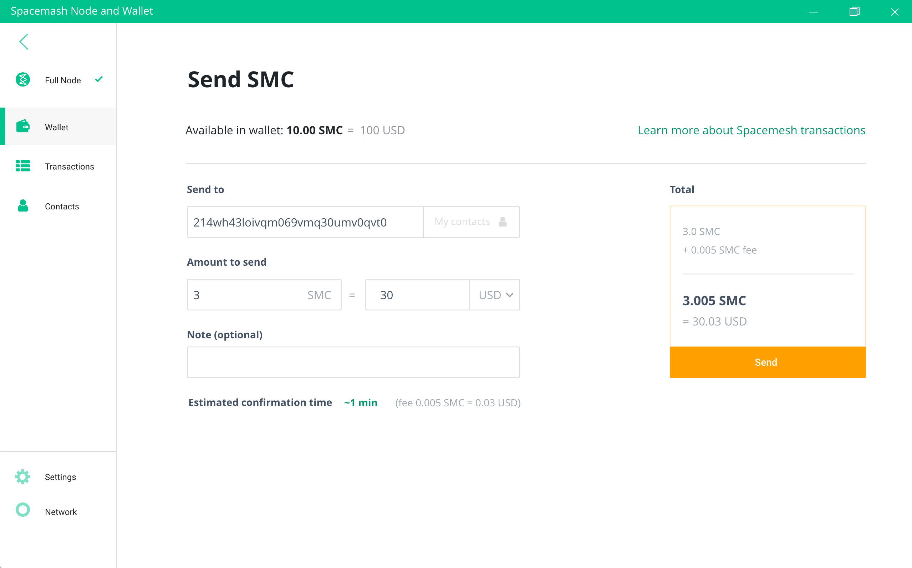

# Sending Coins

1. Access your wallet screen and click on the big 'Send Coin' button...

2. Paste the coin recipient address he or she shared with you in this screen:

3. Enter the Spacemesh Coin (SMC) amount you'd like to send.

4. Click on the `SEND` button

Review the transaction details in this screen and click on `Confirm`:

Track the transaction status in your main wallet screen in the `Latest Transactions` section on the right side:

