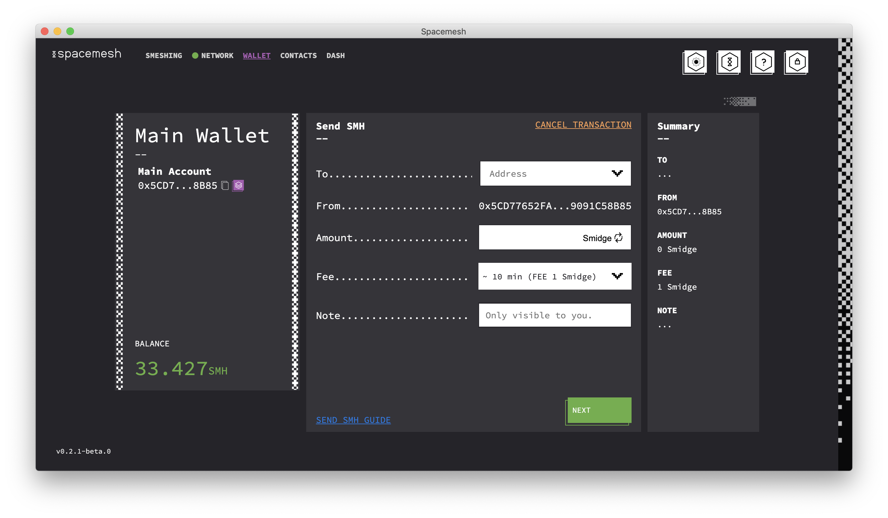
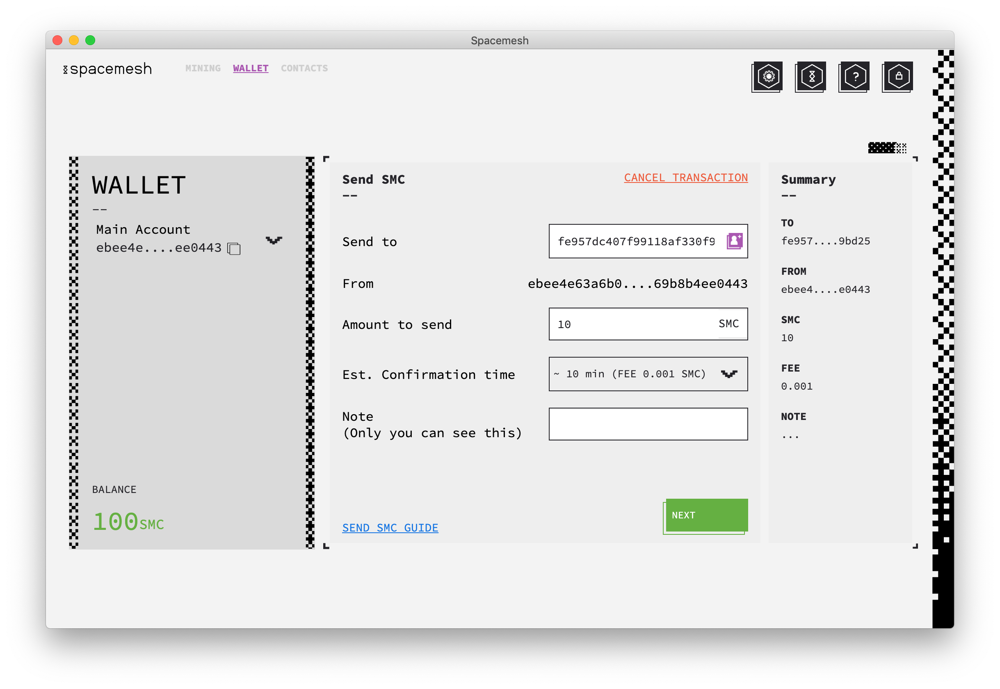
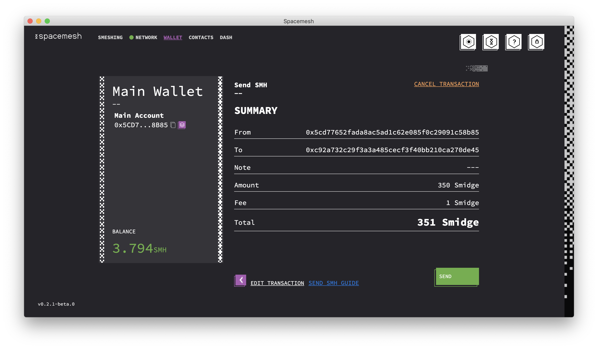
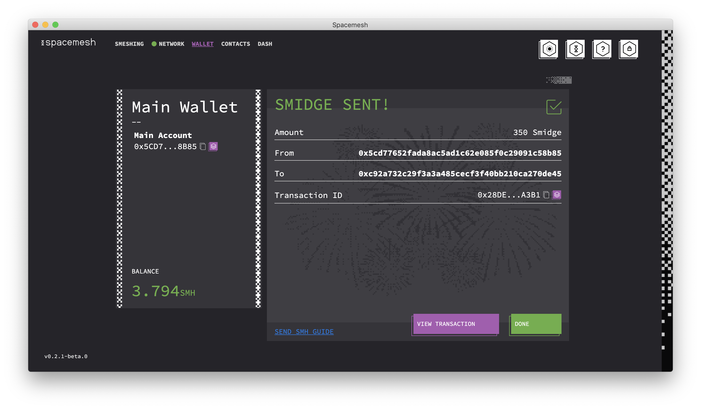
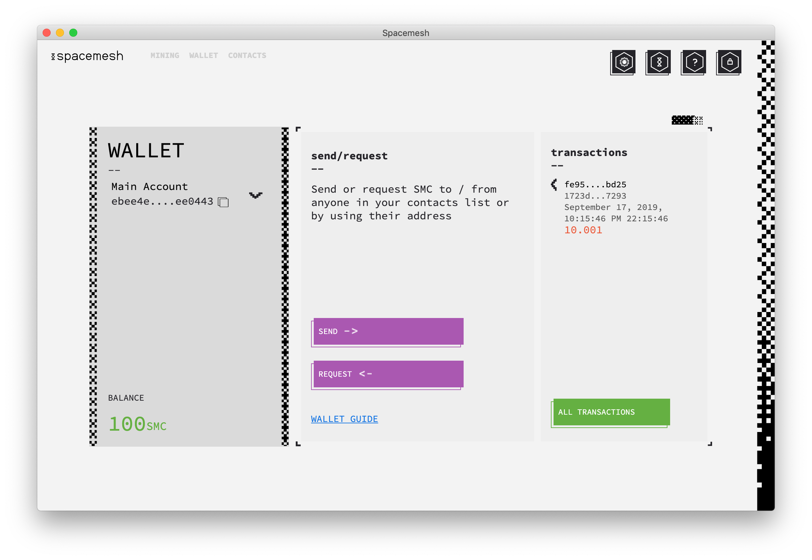
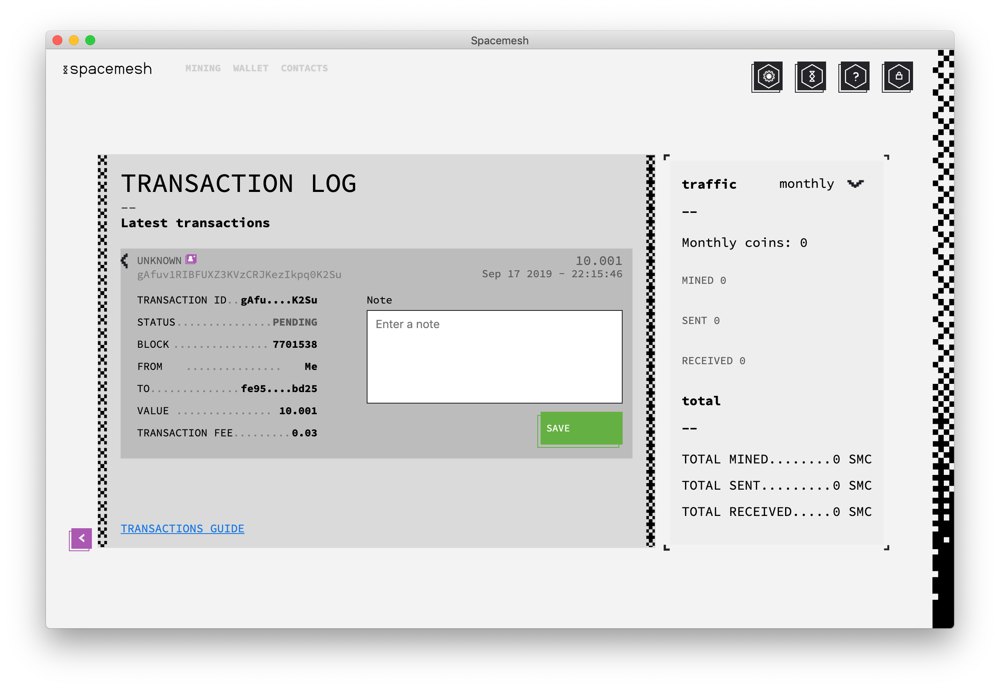

# Sending Smesh

1. Navigate to the Wallet screen by clicking `WALLET` in the top-left side of the screen.

2. Click on the `SEND` button.

You should see the Send SMH screen:

2. Paste the Smesh recipient public account address that he or she shared with you into the `Send to` field.

3. Enter the Smesh (SMH) amount you would like to send to the recipient in the `Amount to send` field.

> The amount must be less than your account's Smesh balance, as you cannot spend Smesh that you do not have.

4. Click `NEXT`.

Review the transaction information in the summary screen:

5. Click `SEND` to execute the transaction.

You should now see this screen:

6. Click on 'DONE'.

Congratulations! You have just sent some Smesh (SMH) to a recipient.

## Tracking your transaction

Your recent transactions are displayed in the `Transactions` area of your Wallet Screen:

1. Click on `ALL TRANSACTIONS` to view the full transactions log.

2. Click on a transaction to view its details:

Notice the transaction status. A new transaction you just executed will be in the `PENDING` state and should move to `CONFIRMED` state once it was added to the Spacemesh ledger.
