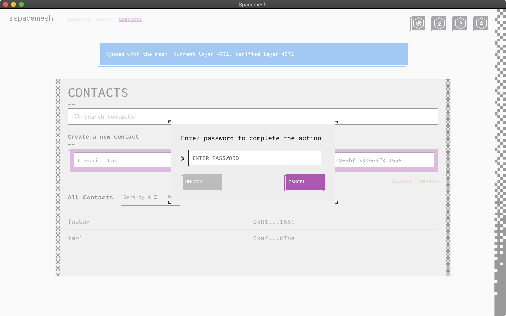
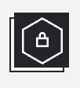
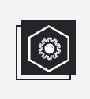
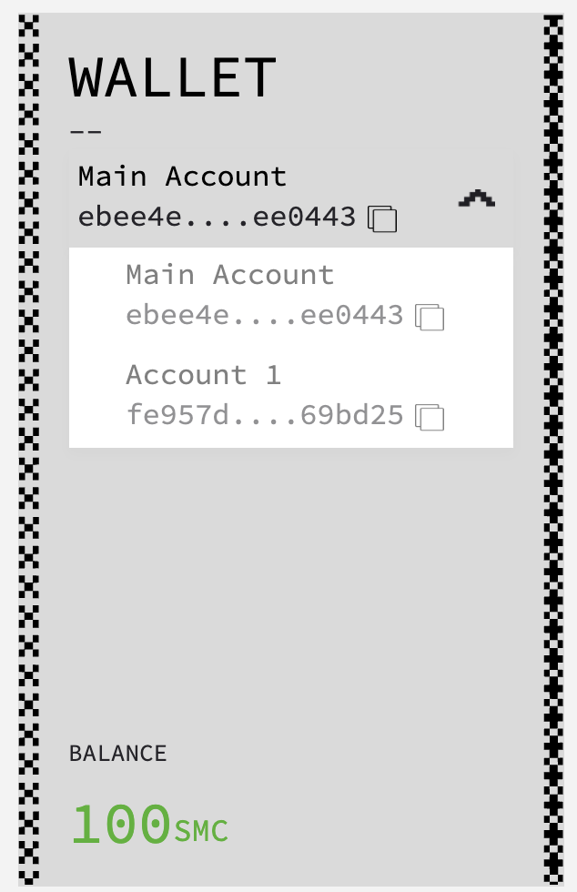

# Using the Spacemesh Wallet

The Spacemesh App includes a wallet for managing your Spacemesh Coins.

Follow the instructions on this page to learn how to use your wallet.

## Accessing your wallet

A new wallet was created when you open the Spacemesh App for the first time.

You were prompted to secure your wallet with a password, and we recommended you store in a password manager app, such as [1Password](https://1password.com).

> Your wallet data is saved in a `wallet file` on your hard drive. The `wallet file` includes sensitive private data that is encrypted in the file with your password.

When you open the Spacemesh App again you should see this screen:

Enter your Wallet password to unlock access to your wallet.

The Wallet data is loaded from the wallet file to the App and is decrypted using your provided password.

> IMPORTANT: you will lose access to your wallet if you forget your password. For this reason, we recommend that you create a `12-words backup` as soon as possible. See [Wallet Backup](#)

## Checking your Spacemesh Coin Balance

After unlocking your wallet with your password, you should see the following wallet screen:

The left side of the screen displays the wallet info:

Your wallet is configured with one main account called `Main Account`. Think of this account as your crypto bank account. You use this account to hold Spacemesh Coins and to send and receive Spacemesh Coins.

Your account is identified by a unique `public address`. It is displayed under the account name in a short-form that looks like this: `0xebee....ee0443`.

Your full account address is a long number, such as `0xebee4e63a6b0f829f3ad06fb6c4aa80a6860774bc25e9c1b1b2c69b8b4ee0443`.

Your account balance is displayed at the bottom left side of the screen. `SMC` is the symbol for 'Spacemesh Coins'.

You can copy your account public address to your computer's clipboard by clicking on the copy icon on the right side of the displayed  account number.

This is useful if you want to receive SMC from another account holder. In this case you just need to send the copied full account address to that person via any digital means such as a text message.

## Sending Spacemesh Coins
Follow the steps in [this guide](send_coin.md) to send Spacemesh Coins to any other account.

## Getting Spacemesh Coins
Follow the steps in [this guide](get_coin.md) to receive coins from another account into your account.

## Locking Access to your Wallet

> When you are done using your wallet in the App, you should `log out` from it to prevent other people with direct access to your computer from viewing your coin balance, from performing transactions and from viewing your transaction history.  

To `log out` from your wallet, just click on the `Lock Button` in the top right side of the wallet screen. It looks like this:

To access your wallet again, open the app and enter your wallet password.

## Backing up and your wallet
Follow the steps in [this guide](backup.md) to backup your wallet and to restore your wallet from backup.

---

# Advanced Wallet Features

## Creating a new account

By default your wallet is pre-configured with one main account. This is sufficient for performing basic transactions and for receiving coin awards for running a full node.

You can add up to 256 additional accounts to your wallet.

Each new account has its own unique public address, coin balance and a friendly display name.

Follow these steps to create a new account:

1. Go to the settings screen by clicking on the `SETTINGS` button on the right-side of the app's main screen. It looks like this:

2. Scroll down to `ACCOUNT SETTINGS`

Your screen should look like this:

3. Click `Add Account`

4. Name your new account

> Newly added accounts are automatically saved in your wallet.

You can easily switch between wallet accounts, view the coin balance of an account, send coin from any account, or receive coin into any account.

To switch between accounts click the account drop-down icon in your wallet display area. All your accounts should be listed in the drop-down menu:

Select the account you want to use from the drop-down menu.

---   

## Additional Guides
- Chose another guide to follow from on of the available [Testnet guides](all.md).
